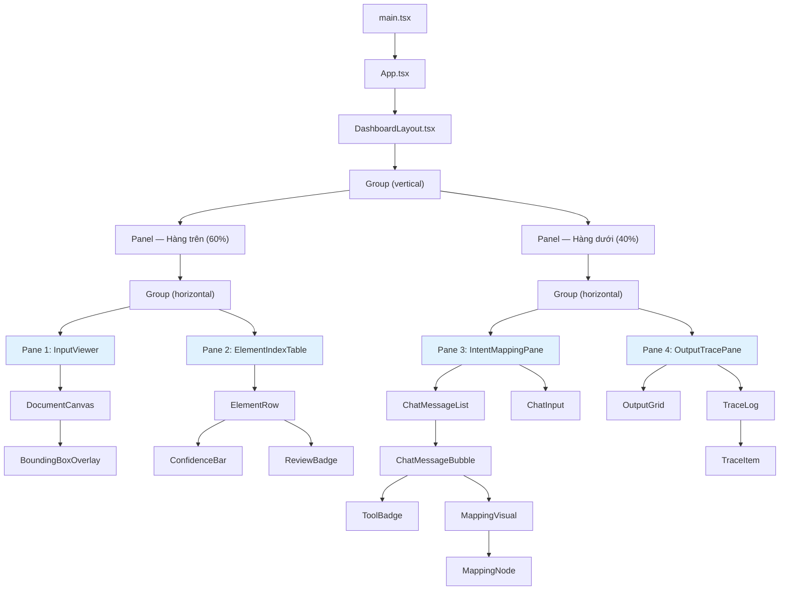
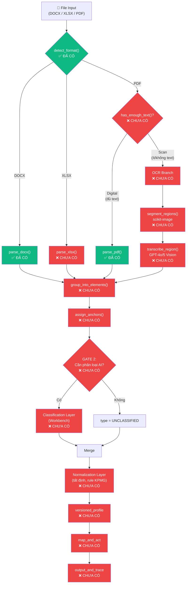
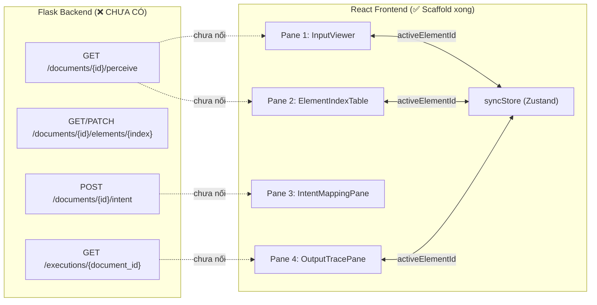

# DocPercepInterac Foundation — Kiểm Kê Toàn Bộ Codebase

> **Tài liệu này mô tả chính xác mọi thứ đang tồn tại trong thư mục dự án tính đến ngày 12/08/2026.**  
> Không suy diễn, không giả định. Những gì chưa có sẽ được ghi rõ là "CHƯA CÓ".

---

## 1. Cây thư mục tổng thể

```
DocPercepInterac Foundation/
├── .claude/                          # Thư mục cấu hình Claude (IDE)
├── .git/                             # Git repository
├── .gitignore                        # 37 dòng — loại trừ Python, Node, secrets, Docling models
│
├── BCTC_hop_nhat_Q2.2026_tu_lap_DT_.docx   # 3.4MB — File mẫu DOCX (thực chất là scan, xem mục 6)
├── CBTTDK_BCTC_HN_Q2.26_VIE_sign.pdf       # 2.5MB — File mẫu PDF (scan, có chữ ký)
├── Neweb VN-2025-VND-VN-1903.pdf            # 766KB — File mẫu PDF (digital thật, 32 trang)
├── Document_Perception_Build_Plan.xlsx      # 28KB — Bảng kế hoạch gốc (Excel)
│
├── Foundation_Build_Plan.md           # 29KB — Build Plan v1 (lịch sử)
├── Foundation_Build_Plan_v3.md        # 20KB — Build Plan v3 (lịch sử)
├── Foundation_Build_Plan_v4.md        # 23KB — Build Plan v4 (lịch sử)
├── Foundation_Build_Plan_v5.md        # 25KB — Build Plan v5 ★ BẢN HIỆN HÀNH
├── Foundation_Master_Context.md       # 31KB — Tài liệu ngữ cảnh tổng thể
├── Foundation_UI_Spec_v2.md           # 32KB — Đặc tả UI v2
│
├── foundation/                        # ★ BACKEND — Python
│   ├── .pytest_cache/                 # Cache pytest (tự sinh)
│   ├── .venv/                         # Virtual environment Python 3.11
│   ├── STATUS.md                      # 277 dòng — Trạng thái build chi tiết
│   ├── requirements.txt               # 49 dòng — Dependencies Python
│   │
│   ├── perception/                    # Package chính — Geometry Layer
│   │   ├── __init__.py                # Rỗng (0 bytes)
│   │   ├── models.py                  # 90 dòng — Pydantic schemas
│   │   ├── detector.py                # 57 dòng — Nhận diện format file
│   │   └── parser.py                  # 135 dòng — Trích xuất geometry
│   │
│   ├── adapters/                      # Package dự phòng — RỖNG
│   │   └── __init__.py                # Rỗng (0 bytes)
│   │
│   ├── api/                           # Package API Flask — RỖNG
│   │   ├── __init__.py                # Rỗng (0 bytes)
│   │   └── routes/
│   │       └── __init__.py            # Rỗng (0 bytes)
│   │
│   ├── models/                        # Thư mục model weights (đã dọn sạch)
│   │   └── README.md                  # 21 dòng — Ghi chú "Docling đã bị xóa"
│   │
│   └── tests/                         # Test suite
│       ├── __init__.py                # Rỗng
│       ├── test_models.py             # 103 dòng — 6 test cases
│       ├── test_detector.py           # 36 dòng — 4 test cases
│       ├── test_parser.py             # 90 dòng — 7 test cases (= tổng 17 tests)
│       └── fixtures/
│           ├── fixture_bcdt.docx      # 3.4MB — Trùng MD5 với file gốc ở root
│           ├── fixture_report.pdf     # 2.5MB — Trùng MD5 với file gốc ở root
│           └── fixture_report_2.pdf   # 766KB — Trùng MD5 với file gốc ở root
│
└── frontend/                          # ★ FRONTEND — React + TypeScript
    ├── .gitignore                     # 25 dòng
    ├── index.html                     # 14 dòng — HTML entry point cho Vite
    ├── mockup-reference.html          # 518 dòng — Bản mockup tĩnh gốc (giữ lại tham chiếu)
    ├── package.json                   # 28 dòng — Dependencies Node.js
    ├── package-lock.json              # 42KB
    ├── vite.config.ts                 # 8 dòng
    ├── tsconfig.json                  # 8 dòng
    ├── tsconfig.app.json              # 27 dòng
    ├── tsconfig.node.json             # 24 dòng
    ├── public/                        # Thư mục static assets
    ├── node_modules/                  # Dependencies đã cài
    ├── *.png                          # 1 ảnh screenshot chatbox (36KB)
    │
    └── src/
        ├── main.tsx                   # 11 dòng — Entry point React
        ├── App.tsx                    # 22 dòng — Component gốc
        ├── index.css                  # 534 dòng — Toàn bộ CSS (design system)
        │
        ├── state/
        │   └── syncStore.ts           # 12 dòng — Zustand store
        │
        ├── types/
        │   ├── element.ts             # 60 dòng — TypeScript mirror của models.py
        │   └── chat.ts                # 38 dòng — Types cho Pane 3 chatbox
        │
        └── components/
            ├── layout/
            │   ├── DashboardLayout.tsx # 37 dòng
            │   └── PaneHeader.tsx      # 16 dòng
            ├── input-viewer/
            │   ├── InputViewer.tsx      # 15 dòng
            │   ├── DocumentCanvas.tsx   # 31 dòng
            │   └── BoundingBoxOverlay.tsx # 31 dòng
            ├── element-index/
            │   ├── ElementIndexTable.tsx # 38 dòng
            │   ├── ElementRow.tsx       # 38 dòng
            │   ├── ConfidenceBar.tsx    # 23 dòng
            │   └── ReviewBadge.tsx      # 4 dòng
            ├── intent-mapping/
            │   ├── IntentMappingPane.tsx # 25 dòng
            │   ├── ChatInput.tsx        # 63 dòng
            │   ├── ChatMessageBubble.tsx # 27 dòng
            │   ├── ChatMessageList.tsx   # 28 dòng
            │   ├── MappingVisual.tsx     # 26 dòng
            │   ├── MappingNode.tsx       # 16 dòng
            │   └── ToolBadge.tsx         # 16 dòng
            └── output-trace/
                ├── OutputTracePane.tsx   # 19 dòng
                ├── OutputGrid.tsx        # 21 dòng
                ├── TraceLog.tsx          # 22 dòng
                └── TraceItem.tsx         # 26 dòng
```

---

## 2. Dependencies — Backend Python

Nguồn: [requirements.txt](file:///c:/Users/PC/Downloads/DocPercepInterac%20Foundation/foundation/requirements.txt) (49 dòng)

### 2.1 Geometry Layer (tất định, không AI)

| Package | Phiên bản | Vai trò | Trạng thái CRADL |
|---|---|---|---|
| `python-docx` | Không pin | Đọc/ghi file DOCX | ✅ Approved |
| `openpyxl` | Không pin | Đọc/ghi file XLSX | ✅ Approved |
| `defusedxml` | Không pin | Parse XML an toàn (chặn XML bomb) | ✅ Approved |
| `pdfplumber` | Không pin | Trích xuất text + bounding box từ PDF | ⏳ Waiting (theo v5) |
| `pdf2image` | Không pin | Render trang PDF thành ảnh | ⏳ Waiting (theo v5) |

### 2.2 Classification Layer (AI qua Workbench)

| Package | Vai trò | Trạng thái CRADL |
|---|---|---|
| `openai` | Client gọi API Workbench | ✅ Approved |
| `azure-identity` | Xác thực Azure | ✅ Approved |
| `msal` | Microsoft Authentication Library | ✅ Approved |
| `azure-core` | Azure SDK core | ✅ Approved |
| `jsonschema` | Validate schema, chặn hallucination | ✅ Approved |
| `tenacity` | Retry logic | ✅ Approved |
| `cachetools` | Cache kết quả | ✅ Approved |
| `numpy` | Tính toán số học | ✅ Approved |
| `pandas` | Xử lý dữ liệu dạng bảng | ✅ Approved |

### 2.3 Shared / Schema

| Package | Vai trò |
|---|---|
| `pydantic>=2` | Data validation & schema |
| `python-multipart` | Xử lý multipart form data |

### 2.4 Access Layer

| Package | Vai trò |
|---|---|
| `flask` | Web framework (thay FastAPI) |
| `werkzeug` | WSGI utilities cho Flask |
| `sqlite3` | Profile store, execution log (stdlib, không cần cài) |

### 2.5 Platform-specific

| Package | Điều kiện | Vai trò |
|---|---|---|
| `python-magic-bin` | Windows only | Phát hiện MIME type (có kèm binary libmagic) |
| `python-magic` | Linux/macOS | Phát hiện MIME type (dùng libmagic hệ thống) |

### 2.6 Dev/Test

| Package | Vai trò |
|---|---|
| `pytest` | Test framework |

### 2.7 Các package ĐÃ CÀI nhưng CHƯA DÙNG trong code

> Các package sau có trong `requirements.txt` và đã cài vào `.venv`, nhưng **không có dòng import nào** trong bất kỳ file source `.py` nào hiện tại:

`openai`, `azure-identity`, `msal`, `azure-core`, `jsonschema`, `tenacity`, `cachetools`, `numpy`, `pandas`, `python-multipart`, `flask`, `werkzeug`, `openpyxl`, `defusedxml`

**Lý do:** Các module sẽ dùng chúng (`element_classifier.py`, `anchor_builder.py`, `api/routes/`, `normalize.py`) đều **chưa được viết**.

### 2.8 Dependency OS-level CHƯA cài

| Binary | Cần cho | Trạng thái |
|---|---|---|
| **Poppler** (`pdftoppm`/`pdftocairo`) | `pdf2image.convert_from_path()` | ❌ Chưa cài trên máy dev |

---

## 3. Dependencies — Frontend Node.js

Nguồn: [package.json](file:///c:/Users/PC/Downloads/DocPercepInterac%20Foundation/frontend/package.json)

### 3.1 Production Dependencies

| Package | Phiên bản | Vai trò | Đang dùng trong code? |
|---|---|---|---|
| `react` | ^19.2.8 | UI framework | ✅ Có |
| `react-dom` | ^19.2.8 | React DOM renderer | ✅ Có |
| `react-resizable-panels` | ^4.12.2 | Splitter/resize panels | ✅ Có (`Group`, `Panel`, `Separator`) |
| `zustand` | ^5.0.14 | State management xuyên pane | ✅ Có (`syncStore.ts`) |

### 3.2 Dev Dependencies

| Package | Phiên bản | Vai trò |
|---|---|---|
| `@types/node` | ^24.13.3 | TypeScript types cho Node.js |
| `@types/react` | ^19.2.17 | TypeScript types cho React |
| `@types/react-dom` | ^19.2.3 | TypeScript types cho ReactDOM |
| `@vitejs/plugin-react` | ^6.0.4 | Vite plugin cho React |
| `oxlint` | ^1.75.0 | Linter |
| `typescript` | ~6.0.2 | TypeScript compiler |
| `vite` | ^8.2.0 | Build tool / dev server |

### 3.3 Packages trong Build Plan v5 nhưng CHƯA CÀI

| Package | Vai trò theo plan | Lý do chưa cài |
|---|---|---|
| `@tanstack/react-query` | Gọi API Flask, cache, refetch | Chưa có API backend để gọi |
| `pdfjs-dist` | Render PDF ở Pane 1 | Chưa tới phase hiển thị PDF thật |
| `xlsx` (SheetJS) | Hiển thị output Excel-like ở Pane 4 | Chưa có output engine |
| `mammoth` | Convert DOCX → HTML phía client | Chưa quyết định convert client hay server |

---

## 4. Các module Python — Phân tích từng file

### 4.1 [perception/models.py](file:///c:/Users/PC/Downloads/DocPercepInterac%20Foundation/foundation/perception/models.py) — 90 dòng

**Mục đích:** Định nghĩa toàn bộ data schema (Pydantic v2) cho dự án.

**Các class đã định nghĩa:**

| Class | Dòng | Mô tả |
|---|---|---|
| `ElementType` | 19-26 | Enum: `heading`, `table`, `cell`, `para`, `picture`, `glossary` |
| `AnchorDOCX` | 28-35 | Tọa độ cho Word: `paragraph_index`, `style_id`, `text_fingerprint`, `table_index`, `row_index`, `col_index` |
| `AnchorXLSX` | 38-42 | Tọa độ cho Excel: `sheet_name`, `cell_address`, `named_range` |
| `AnchorPDF` | 45-49 | Tọa độ cho PDF: `page`, `bbox_relative` (tuple 4 số, scale 0-1), `reading_order_index` |
| `Anchor` | 52 | Union type: `AnchorDOCX | AnchorXLSX | AnchorPDF` |
| `Element` | 55-63 | Một hàng trong Element Index: `index`, `section`, `type`, `name`, `anchor`, `confidence` |
| `ElementIndex` | 66-75 | Toàn bộ Element Index cho 1 tài liệu: `doc_id`, `source_path`, `format`, `elements[]`, `created_at` |
| `ProfileField` | 78-81 | Trường trong Profile: `field_name`, `match_rule` (label/structural/fingerprint), `anchor_pattern` |
| `Profile` | 84-89 | Profile tái sử dụng: `profile_id`, `version`, `document_type`, `fields[]`, `coverage_pct` |

**Các trường THIẾU so với Build Plan v5:**

| Trường | Class | Yêu cầu v5 | Trạng thái |
|---|---|---|---|
| `text: str` | `Element` | Nội dung text gốc | ❌ CHƯA CÓ |
| `text_normalized: str \| None` | `Element` | Kết quả sau Normalization | ❌ CHƯA CÓ |
| `source: Literal["text_layer", "ocr", "manual"]` | `Element` | Phân biệt nguồn gốc element | ❌ CHƯA CÓ |
| `formula: str \| None` | `ProfileField` | Dành chỗ cho Template Authoring Phase 2 | ❌ CHƯA CÓ |

---

### 4.2 [perception/detector.py](file:///c:/Users/PC/Downloads/DocPercepInterac%20Foundation/foundation/perception/detector.py) — 57 dòng

**Mục đích:** Nhận diện định dạng file trước khi parse.

**Hàm duy nhất:**

```python
def detect_format(path: str) -> DetectedFormat:
```

**Thuật toán:**
1. Kiểm tra file có tồn tại không → `ValueError` nếu không.
2. Lấy phần đuôi file (`.docx`, `.xlsx`, `.pdf`) → `ValueError` nếu không hỗ trợ.
3. Dùng `python-magic` (libmagic) để đọc MIME type thực tế của file.
4. So sánh MIME type với bảng mapping cố định `SUPPORTED_MIME_TYPES` → `ValueError` nếu mismatch (file bị đổi đuôi hoặc hỏng).
5. Trả về `DetectedFormat` (`format`, `mime`, `size`).

**Đánh giá:** Đây là thuật toán **hoàn chỉnh và đang hoạt động**. Tất định 100%.

---

### 4.3 [perception/parser.py](file:///c:/Users/PC/Downloads/DocPercepInterac%20Foundation/foundation/perception/parser.py) — 135 dòng

**Mục đích:** Geometry Layer — trích xuất vị trí hình học của mọi khối text trong tài liệu.

**Kiểu dữ liệu:**

```python
class GeometryBlock(TypedDict):
    text: str
    paragraph_index: Optional[int]   # DOCX
    style_id: Optional[str]          # DOCX
    table_index: Optional[int]       # DOCX
    row_index: Optional[int]         # DOCX
    col_index: Optional[int]         # DOCX
    page: Optional[int]              # PDF
    bbox: Optional[tuple[float, float, float, float]]  # PDF (x0, top, x1, bottom)
```

> [!WARNING]
> `GeometryBlock` hiện tại **KHÔNG có trường cho XLSX** (`sheet_name`, `cell_address`, `named_range`). Chưa hỗ trợ Excel.

**Các hàm đã viết:**

#### `parse_docx(path: str) -> list[GeometryBlock]`
- **Thuật toán:**
  1. Mở file bằng `python-docx.Document()`.
  2. Duyệt tuần tự `doc.paragraphs` (theo thứ tự body): mỗi paragraph không rỗng → 1 `GeometryBlock` với `paragraph_index` và `style_id`.
  3. Duyệt tuần tự `doc.tables` → mỗi cell không rỗng → 1 `GeometryBlock` với `table_index`, `row_index`, `col_index`.
  4. Trả về danh sách block theo đúng thứ tự đọc.
- **Tất định:** ✅ 100%. Chạy 2 lần cho cùng input → kết quả y hệt.
- **Trạng thái:** Đang hoạt động.

#### `parse_pdf(path: str) -> list[GeometryBlock]`
- **Thuật toán:**
  1. Mở file bằng `pdfplumber.open()`.
  2. Duyệt từng trang (`pdf.pages`), từng dòng text (`page.extract_text_lines()`).
  3. Mỗi dòng không rỗng → 1 `GeometryBlock` với `page` (1-indexed) và `bbox` `(x0, top, x1, bottom)`.
  4. PDF scan (không có text layer) → trả về danh sách rỗng, KHÔNG crash.
- **Tất định:** ✅ 100%.
- **Trạng thái:** Đang hoạt động.

#### `render_pdf_pages(path: str, dpi: int = 150)`
- **Thuật toán:** Gọi `pdf2image.convert_from_path()` để render từng trang PDF thành ảnh.
- **Trạng thái:** ❌ **KHÔNG HOẠT ĐỘNG** — thiếu Poppler binary trên máy dev. Gọi sẽ raise `PDFInfoNotInstalledError`.

#### `extract_geometry(path: str) -> list[GeometryBlock]`
- **Thuật toán:** Dispatch theo đuôi file:
  - `.docx` → `parse_docx()`
  - `.pdf` → `parse_pdf()`
  - Khác → `ValueError`
- **THIẾU:** Nhánh `.xlsx` chưa được viết.
- **Trạng thái:** Hoạt động cho DOCX và PDF.

---

## 5. Thuật toán — Tổng kết toàn bộ

### 5.1 Các thuật toán ĐÃ CÓ trong code

| # | Tên | File | Loại | Mô tả |
|---|---|---|---|---|
| 1 | Format Detection | `detector.py` | Tất định | Kiểm tra đuôi file + MIME type, reject nếu mismatch |
| 2 | DOCX Geometry Extraction | `parser.py` | Tất định | Duyệt paragraphs + table cells, trả GeometryBlock[] |
| 3 | PDF Geometry Extraction | `parser.py` | Tất định | Duyệt text lines + bounding box qua pdfplumber |
| 4 | Cross-Pane Sync | `syncStore.ts` | UI | Zustand store chia sẻ `activeElementId` giữa 4 pane |

### 5.2 Các thuật toán CHƯA CÓ (thiết kế có trong Build Plan v5 nhưng 0 dòng code)

| # | Tên | File dự kiến | Loại | Mô tả |
|---|---|---|---|---|
| 1 | **XLSX Geometry Extraction** | `parser.py` | Tất định | Đọc sheet/cell/named range qua openpyxl |
| 2 | **GATE 1 — has_enough_text()** | `parser.py` | Tất định | Phát hiện PDF digital vs scan (đếm mật độ text) |
| 3 | **OCR Region Segmentation** | Chưa có file | Tất định | Dùng scikit-image phân vùng ảnh trang scan |
| 4 | **OCR Transcription** | Chưa có file | Có AI | Gửi ảnh crop vùng nhỏ lên GPT-4o/GPT-5 |
| 5 | **Element Classification** | `element_classifier.py` | Có AI | Phân loại element: heading/table/para... |
| 6 | **Anchor Building** | `anchor_builder.py` | Tất định | Gán Anchor ổn định (Resolution Ladder 3 chiến lược) |
| 7 | **group_into_elements()** | Chưa có file | Tất định | Gom GeometryBlock[] → Element[] |
| 8 | **Normalization** | `normalize.py` | Tất định | Chuẩn hóa VND/VNĐ, ngày tháng theo rule KPMG |
| 9 | **Output Engine** | Chưa có file | Tất định | 3 chế độ: Clone & Replace / Profile Fill / Task-shaped |
| 10 | **Model Bake-off** | Chưa có file | Benchmark | So sánh CER trên 4 model GPT cho OCR |
| 11 | **Flask API Routes** | `api/routes/` | HTTP | Các endpoint REST |

---

## 6. Test Fixtures — Phân tích chi tiết

Nguồn: `foundation/tests/fixtures/`

| File | Kích thước | Nội dung thật | Dùng được cho | Hạn chế |
|---|---|---|---|---|
| `fixture_bcdt.docx` | 3.4MB | File scan giả dạng DOCX — chứa 65 ảnh trang nhúng (`word/media/image*.png`), chỉ 2/252 paragraph có text | Test `parse_docx()` chạy không crash | Không test được anchor phức tạp (heading trùng style, table…) |
| `fixture_report.pdf` | 2.5MB | PDF scan thuần ảnh, 0 ký tự text trên mọi trang | Test `parse_pdf()` trả 0 block, không crash | Không dùng được cho Geometry Layer |
| `fixture_report_2.pdf` | 766KB | PDF digital thật, 32 trang, 9691 từ, 968 dòng, 40 nhóm text lặp lại | Test PDF digital, diversity, duplicate text | Tốt nhất hiện có |

**Fixtures THIẾU:**

| Loại | Cần cho | Trạng thái |
|---|---|---|
| DOCX digital đa dạng (heading trùng style, table phức tạp) | Test anchor_builder.py Strategy 2/3 | ❌ Chưa có |
| XLSX mẫu (named ranges, merged cells, nhiều sheet) | Test parse_xlsx() | ❌ Chưa có — **CRITICAL PATH** cho demo |
| Ảnh scan tài chính tiếng Việt + ground truth | Model bake-off OCR | ❌ Chưa có |

---

## 7. Test Suite — Kết quả

**Lần chạy cuối cùng: 16/16 PASS trong 3.60 giây**

### 7.1 [test_models.py](file:///c:/Users/PC/Downloads/DocPercepInterac%20Foundation/foundation/tests/test_models.py) — 6 tests

| Test | Mô tả |
|---|---|
| `test_docx_anchor_model_dump_json_is_valid_json` | AnchorDOCX → JSON → parse lại, đúng format |
| `test_xlsx_anchor_roundtrip` | AnchorXLSX → JSON → parse lại, đúng sheet/cell |
| `test_pdf_anchor_bbox_relative_bounds` | AnchorPDF bbox trong khoảng 0-1 |
| `test_anchor_union_discriminates_by_format` | Union type phân biệt đúng kiểu Anchor qua field `format` |
| `test_confidence_bounds` | Confidence nằm trong [0.0, 1.0] |
| `test_profile_field_and_version` | Profile + ProfileField tạo được, version đúng |

### 7.2 [test_detector.py](file:///c:/Users/PC/Downloads/DocPercepInterac%20Foundation/foundation/tests/test_detector.py) — 4 tests

| Test | Mô tả |
|---|---|
| `test_detect_docx` | Nhận diện đúng file DOCX |
| `test_detect_pdf` | Nhận diện đúng file PDF + MIME |
| `test_detect_unsupported_extension_raises_clear_error` | File `.txt` → ValueError rõ ràng |
| `test_detect_missing_file_raises` | File không tồn tại → ValueError |

### 7.3 [test_parser.py](file:///c:/Users/PC/Downloads/DocPercepInterac%20Foundation/foundation/tests/test_parser.py) — 7 tests

| Test | Mô tả |
|---|---|
| `test_parse_docx_returns_ordered_blocks_with_indices` | DOCX trả block đúng thứ tự, mỗi block hoặc para hoặc cell |
| `test_parse_docx_under_60s_cpu` | Parse DOCX xong trong < 60 giây |
| `test_parse_pdf_digital_returns_blocks_with_bbox` | PDF digital có block với page ≥ 1 và bbox 4 số |
| `test_parse_pdf_digital_has_realistic_multipage_diversity` | PDF 32 trang có text lặp ≥ 10 lần (test case cho anchor) |
| `test_parse_pdf_scanned_returns_no_crash_zero_blocks` | PDF scan → 0 block, không crash |
| `test_extract_geometry_dispatches_by_extension` | Dispatch `.docx` → `parse_docx()` |
| `test_extract_geometry_rejects_unsupported_extension` | File `.txt` → ValueError |

---

## 8. Frontend — Kiểm kê component

### 8.1 Kiến trúc tổng thể



### 8.2 State Management

**File:** [syncStore.ts](file:///c:/Users/PC/Downloads/DocPercepInterac%20Foundation/frontend/src/state/syncStore.ts)

```typescript
interface SyncState {
  activeElementId: string | null;   // ID của element đang được hover
  setActive: (id: string | null) => void;
}
```

**Cơ chế:** Khi user hover vào 1 element ở bất kỳ Pane nào, `setActive(elementId)` được gọi. Mọi component ở các Pane khác đều subscribe vào `activeElementId` và tự highlight nếu match.

**Các component đang dùng `useSyncStore`:**
- `BoundingBoxOverlay` (Pane 1) — hover bbox → highlight
- `ElementRow` (Pane 2) — hover hàng → highlight
- `TraceItem` (Pane 4) — hover trace item → highlight

### 8.3 Trạng thái từng component

| Component | Pane | Có mock data? | Nối API? | Tương tác thật? |
|---|---|---|---|---|
| `InputViewer` | 1 | ❌ Hiển thị empty state | ❌ | Chưa |
| `DocumentCanvas` | 1 | ❌ "Chưa có tài liệu nào" | ❌ | Chưa |
| `BoundingBoxOverlay` | 1 | ❌ Không render vì chưa có data | ❌ | Hover sync sẵn sàng |
| `ElementIndexTable` | 2 | ❌ "Chưa có element nào" | ❌ | Chưa |
| `ElementRow` | 2 | ❌ | ❌ | Hover sync sẵn sàng |
| `ConfidenceBar` | 2 | ❌ | ❌ | Sẵn sàng render khi có data |
| `ReviewBadge` | 2 | ❌ | ❌ | Sẵn sàng (hiện khi confidence < 0.8) |
| `IntentMappingPane` | 3 | ❌ "Chưa có hội thoại nào" | ❌ | Chưa |
| `ChatInput` | 3 | N/A | ❌ | Gõ text được thật, nút Gửi **disabled** |
| `ChatMessageList` | 3 | ❌ | ❌ | Chưa |
| `OutputGrid` | 4 | ❌ Khung Excel trống (A/B/C) | ❌ | Chưa |
| `TraceLog` | 4 | ❌ "Chưa có execution log nào" | ❌ | Chưa |

### 8.4 CSS Design System

**File:** [index.css](file:///c:/Users/PC/Downloads/DocPercepInterac%20Foundation/frontend/src/index.css) — 534 dòng

| Design Token | Giá trị | Mô tả |
|---|---|---|
| `--primary` | `#00338D` | Màu KPMG chính |
| `--primary-light` | `rgba(0, 51, 141, 0.1)` | Highlight nhẹ |
| `--bg-body` | `#f8fafc` | Nền body |
| `--bg-pane` | `#ffffff` | Nền panel |
| `--border` | `#e2e8f0` | Viền chia |
| `--text-main` | `#334155` | Chữ chính |
| `--text-muted` | `#64748b` | Chữ phụ |
| `--font-family` | Inter, system fonts | Font chữ |
| `--transition` | `all 0.2s ease-in-out` | Hiệu ứng chuyển tiếp |

---

## 9. Các thư mục/package RỖNG (chỉ có `__init__.py`)

| Package | Đường dẫn | Vai trò theo plan | Trạng thái |
|---|---|---|---|
| `adapters/` | `foundation/adapters/` | Format adapters (kết nối Geometry Layer với các library) | Rỗng hoàn toàn |
| `api/` | `foundation/api/` | Flask app instance | Rỗng hoàn toàn |
| `api/routes/` | `foundation/api/routes/` | REST endpoints | Rỗng hoàn toàn |

**Không có `Flask(__name__)` hay bất kỳ route nào trong toàn bộ codebase.** API chưa tồn tại.

---

## 10. Workflow — Kiến trúc Pipeline (theo Build Plan v5)

### 10.1 Pipeline tổng thể (thiết kế)



> **Chú thích:** 🟢 Xanh = Đã có code hoạt động. 🔴 Đỏ = Chưa có dòng code nào.

### 10.2 Frontend — Luồng dữ liệu (thiết kế)



---

## 11. Tài liệu kế hoạch trong repo

| File | Kích thước | Vai trò | Còn dùng? |
|---|---|---|---|
| `Foundation_Build_Plan.md` | 29KB | Build Plan v1 | ❌ Lịch sử |
| `Foundation_Build_Plan_v3.md` | 20KB | Build Plan v3 — kiến trúc 2 lớp chi tiết | ⚠️ v5 tham chiếu data model/API từ đây |
| `Foundation_Build_Plan_v4.md` | 23KB | Build Plan v4 — thêm Normalization, UI thật | ⚠️ v5 tham chiếu UI spec từ đây |
| `Foundation_Build_Plan_v5.md` | 25KB | Build Plan v5 ★ **BẢN HIỆN HÀNH** | ✅ Nguồn sự thật |
| `Foundation_Master_Context.md` | 31KB | Ngữ cảnh tổng thể, use case gốc | ✅ Vẫn tham chiếu |
| `Foundation_UI_Spec_v2.md` | 32KB | Đặc tả giao diện UI chi tiết | ✅ Vẫn tham chiếu |
| `Document_Perception_Build_Plan.xlsx` | 28KB | Bảng kế hoạch dạng Excel | ⚠️ Không rõ có cập nhật |
| `foundation/STATUS.md` | 23KB | Trạng thái build chi tiết | ✅ Cập nhật thường xuyên |

---

## 12. Tóm tắt — Cái gì ĐÃ CÓ, cái gì CHƯA CÓ

### ĐÃ CÓ VÀ HOẠT ĐỘNG

| Hạng mục | Chi tiết |
|---|---|
| **3 thuật toán tất định** | `detect_format()`, `parse_docx()`, `parse_pdf()` |
| **Data schema đầy đủ** | 9 class Pydantic (thiếu 4 trường nhỏ so với v5) |
| **Test suite: 17 tests, 100% pass** | 6 + 4 + 7 tests, chạy trong 3.6 giây |
| **Frontend scaffold: 20 components** | React 19 + TypeScript + Zustand + Vite, 4-pane layout resize được |
| **CSS Design System** | 534 dòng, màu KPMG `#00338D`, transitions, animations |
| **Git repo** | Có lịch sử commit, đẩy lên GitHub |

### CHƯA CÓ (0 DÒNG CODE)

| Hạng mục | Ảnh hưởng |
|---|---|
| **parse_xlsx()** | ❌ Chặn use case demo chính (Local File Mapping) |
| **anchor_builder.py** | ❌ IP quan trọng nhất, chưa bắt đầu |
| **element_classifier.py** | ❌ Phân loại AI chưa có |
| **Normalization Layer** | ❌ Chuẩn hóa dữ liệu chưa có |
| **Output Engine** | ❌ Không ghi ra được file nào |
| **OCR Branch** | ❌ Thiết kế có trong v5, code chưa có |
| **Flask API (toàn bộ)** | ❌ Không có endpoint nào — frontend không kết nối được backend |
| **Application Layer** | ❌ extract/translate/mapping/compare chưa tồn tại |
| **Model Bake-off** | ❌ Script benchmark chưa có |
| **Fixture XLSX mẫu** | ❌ Chưa có file test cho Excel |

---

*Tài liệu này được tạo bởi rà soát thủ công toàn bộ 45+ file source trong codebase, không suy diễn hay bổ sung nội dung ngoài những gì thực sự tồn tại trong code.*
