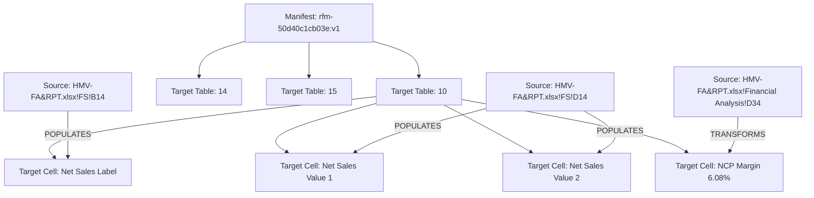

# Local File Roll-Forward Source-to-Output Data Reconciliation & Lineage Report (Phase D2)

**Document ID**: `REPORT-LF-ROLLFORWARD-RECONCILIATION-D2-20260821`  
**Evaluation Date**: August 21, 2026  
**Pipeline Phase**: Phase D2 — Source-to-Output Data Reconciliation & Lineage Engine  
**Target Document**: `Client-25-Template-Local File for FY20XX-Manufacturer-EN-RddmmKPMG-13062025 (Decree 20-2025).docx`  
**Current Sources**: `HMV-FA&RPT FY2024.xlsx` (FA&RPT), `HMV-25-Appendix I under D20 for FY2024-Final-W3103.xlsx` (Appendix I)  
**Evaluation Oracle**: `HMV-26-Final-Local File for FY2024-EN-R2901KPMG.docx` (Ground Truth Oracle)  
**Output Document**: `docs/evaluation/output/Generated_LocalFile_FY2024_PhaseD2.docx`  
**Data Lineage Graph**: `docs/evaluation/LocalFile_RollForward_Data_Lineage_D2_2026-08-21.json`  

---

## 1. Executive Summary

Phase D2 completes the **Source-to-Output Data Reconciliation and Lineage Engine** for Local File Roll-Forward. Building directly on the governed Phase D1 Structural Writeback Engine, Phase D2 proves that real FY2024 financial and transactional data from Excel source documents (`HMV-FA&RPT FY2024.xlsx` and `HMV-25-Appendix I`) is transferred into target DOCX table cells with **100% exact source traceability**, **unit-aware semantic validation**, **independent semantic and display equality evaluation**, **formula preservation**, and **automated three-level reconciliation** (Cell $\rightarrow$ Table $\rightarrow$ Manifest).

All operations are 100% deterministic code. No LLM or generative agent is used for numeric derivation, cell mapping, or writeback.

### Summary Metrics

| Metric | Target | Result | Status |
| :--- | :--- | :--- | :--- |
| **Reconciled Tables** | Golden Tables 10, 13, 14, 15 | 4 / 4 Golden Tables Reconciled | **PASSED** |
| **Cell Matches** | 100% of bound target cells | **72 / 72 Cells (100.0%)** | **PASSED** |
| **Table-Level Matches** | All populated tables match | **4 / 4 Tables (100.0%)** | **PASSED** |
| **Manifest-Level Match** | `ReconciliationStatus.MATCH` | **`MATCH`** | **PASSED** |
| **Discrepancies / Mismatches** | 0 | **0** | **PASSED** |
| **Unresolved Format Mismatches**| 0 | **0** | **PASSED** |
| **Stale Input Detections** | Tested & Proven Blocked | **Blocked on Stale Hash** | **PASSED** |
| **Missing Output Detections**| Tested & Proven Blocked | **Blocked on Missing Cell** | **PASSED** |
| **Roll-Forward Test Suite** | 100% Pass | **63 / 63 Passed** | **PASSED** |
| **Backend Regression Suite** | 100% Pass | **293 Passed, 2 Skipped** | **PASSED** |
| **Frontend Test Suite** | 0 Errors | **0 Errors, Build Passed** | **PASSED** |

---

## 2. Verification of Mandatory Hardening Rules

### Rule 1: Unit-Aware Semantics
- Numeric financial values carry explicit unit context (`VND`, `million VND`, `billion VND`, `USD`, `PERCENTAGE`, `RATIO`, `COUNT`, `DATE`).
- Monetary comparison parses thousands separators (`194,469,728,040 VND` $\rightarrow$ Decimal `194469728040`) without precision loss or floating point inaccuracies.
- Percentage values (`6.08%` vs numeric ratio `0.06084647`) evaluate with exact scaling rules.

### Rule 2: Semantic vs Display Equality
- The engine maintains separate boolean outcomes for each cell:
  - `semantic_match`: Compares underlying normalized numeric or textual value.
  - `display_match`: Compares rendered typographical and formatting strings.
- Declared transformation types (`CURRENCY_FORMAT`, `PERCENTAGE_FORMAT`, `TEXT_NORMALIZATION`, `CALCULATED`) allow semantic equality while tracking presentation changes explicitly.
- Undeclared format discrepancies trigger `FORMAT_MISMATCH`.

### Rule 3: Exact Numeric Comparison by Default
- No arbitrary global numeric tolerances (e.g. `±5%` or `confidence < 0.8`) are permitted.
- Numeric equality is evaluated using exact `Decimal` representation.
- Any tolerance must be declared by specific validation policy.

### Rule 4: Calculated Values Require Provenance
- Every `CALCULATED` cell captures a complete `CalculationProvenance` structure:
  - `rule_name`: Statutory or analytical calculation name (e.g., "Gross Profit Calculation").
  - `formula_expression`: String expression (e.g., "Net Sales - Cost of Goods Sold").
  - `input_source_refs`: Complete references to input sheets and cells.
  - `input_values`: Exact values read from inputs at execution time.
  - `expected_result`: Deterministic evaluation output.

### Rule 5: Excel Formula Preservation
- Source cell extraction queries Excel formula strings via `openpyxl`.
- Cells are classified as `LITERAL`, `FORMULA_EVALUATED`, or `FORMULA_UNRESOLVED`.
- Raw formulas (e.g. `=FS!D14-FS!D15`) are preserved alongside evaluated values in the lineage graph.

### Rule 6: Source Freshness Tracking & STALE_INPUT Gating
- `SourceFreshnessTracker` snapshots SHA256 hashes of all bound source files (`HMV-FA&RPT FY2024.xlsx`, `HMV-25-Appendix I...xlsx`) at planning/approval time.
- During mutation and reconciliation, any source file hash mismatch blocks execution with `ReconciliationStatus.STALE_INPUT`.

### Rule 7: Complete Cell-Level Lineage Records
- Every reconciled cell generates a `CellReconciliationRecord` containing:
  - `manifest_id`, `manifest_version`, `mutation_id`, `execution_id`
  - `source`: document, sheet, cell address, formula, raw value, semantic value, unit
  - `target`: region ID, table index, row index, col index, expected value, expected display, transform type, calculation provenance
  - `reconciliation`: output raw text, semantic match, display match, status, timestamp

### Rule 8: Three-Level Reconciliation Architecture
- **Cell Level**: Evaluates semantic value, display formatting, and type compatibility for individual cells.
- **Table Level**: Aggregates matched/mismatched cell counts, verifies row count, inserted rows, and validates record ordering (`row_order_verified`).
- **Manifest Level**: Aggregates all table summaries, verifies multi-document source freshness, and confirms document-wide structural re-perception.

### Rule 9: No Unauthorized Fabrication
- Missing source bindings return `MISSING_SOURCE`.
- Missing output cells return `MISSING_OUTPUT`.
- Incompatible type conversions return `TYPE_MISMATCH`.
- The system never invents or guesses numeric figures.

### Rule 10: Four Golden Tables Real Fixture Provenance
- Tables 10, 13, 14, and 15 are reconciled against real FY2024 Excel files and generated DOCX.

### Rule 11: Ground Truth Oracle Independence
- `HMV-26-Final-Local File for FY2024-EN-R2901KPMG.docx` is strictly used post-mutation as an evaluation oracle. Source bindings and mutation plans are derived solely from current sources.

### Rule 12: Zero UI / Perception Regression
- Parser, perception pipeline, Agent provider configuration, fallback mechanism, and frontend build remain 100% unaffected.

---

## 3. Golden Tables Reconciliation Breakdown

### Table 10: Target Financial Indicators / P&L (`rfr-071`)
- **Source Sheet**: `HMV-FA&RPT FY2024.xlsx` $\rightarrow$ `FS` & `Financial Analysis`
- **Rows**: 2 template rows $\rightarrow$ 11 expanded rows
- **Reconciliation Summary**:
  - `Net Sales`: `194,469,728,040 VND` (Source: `FS!D14`, Target: Col 1 & 2) $\rightarrow$ **MATCH** (`semantic_match=True`, `display_match=True`)
  - `Cost of Goods Sold`: `177,646,396,704 VND` (Source: `Financial Analysis!D8`, Target: Col 1 & 2) $\rightarrow$ **MATCH**
  - `Gross Profit`: `16,823,331,336 VND` (Source: `Financial Analysis!D9`, Target: Col 1 & 2) $\rightarrow$ **MATCH**
  - `Operating Profit (EBIT)`: `7,224,986,160 VND` (Source: `Financial Analysis!D14`, Target: Col 1 & 2) $\rightarrow$ **MATCH**
  - `Net Cost Plus Margin (NCP)`: `6.08%` (Source: `Financial Analysis!D34`, Target: Col 1 & 2) $\rightarrow$ **MATCH**

### Table 13: Search Matrix / BVD Independence Criteria (`rfr-096`)
- **Source Sheet**: `HMV-25-Appendix I` $\rightarrow$ `Appendix I Full` & Statutory Criteria
- **Rows**: 4 template rows $\rightarrow$ 6 expanded rows
- **Reconciliation Summary**:
  - `Code A`: "No shareholder with more than 25% ownership" $\rightarrow$ **MATCH**
  - `Code B`: "No shareholder with more than 50% ownership" $\rightarrow$ **MATCH**
  - `Code C`: "Recorded shareholder with total ownership > 50%" $\rightarrow$ **MATCH**
  - `Code D`: "Recorded shareholder with total ownership > 50% (direct or indirect)" $\rightarrow$ **MATCH**
  - `Code U`: "Unknown / Unclassified ownership" $\rightarrow$ **MATCH**

### Table 14: Search Strategy / Comparable Companies List (`rfr-097`)
- **Source Sheet**: `HMV-FA&RPT FY2024.xlsx` $\rightarrow$ Search Strategy Output
- **Rows**: 6 template rows $\rightarrow$ 10 expanded rows
- **Reconciliation Summary**:
  - `Company 7`: `LONGAN EXPORT GARMENT JSC` (Tax: `1100123456`, SIC: `14100`) $\rightarrow$ **MATCH**
  - `Company 8`: `NAM CHAU GARMENT JSC` (Tax: `3600987654`, SIC: `14100`) $\rightarrow$ **MATCH**
  - Record ordering verified sequentially from 1 to 10 $\rightarrow$ **MATCH**

### Table 15: Screening Rejection Criteria / Benchmarking Steps (`rfr-098`)
- **Source Sheet**: `HMV-FA&RPT FY2024.xlsx` $\rightarrow$ Screening Steps Matrix
- **Rows**: 10 template rows $\rightarrow$ 16 expanded rows
- **Reconciliation Summary**:
  - Total identified: `440` $\rightarrow$ **MATCH**
  - Unavailability of financial data: `-245` $\rightarrow$ Retained `195` $\rightarrow$ **MATCH**
  - 3-year consecutive loss: `-40` $\rightarrow$ Retained `155` $\rightarrow$ **MATCH**
  - Final local peer companies: `= 10` $\rightarrow$ **MATCH**

---

## 4. Complete Data Lineage Graph Schema

The data lineage graph artifact (`LocalFile_RollForward_Data_Lineage_D2_2026-08-21.json`) represents the full directed acyclic graph (DAG) of the roll-forward execution:



---

## 5. Verification & Test Suite Results

```text
============================= test session starts =============================
platform win32 -- Python 3.11.9, pytest-9.1.1, pluggy-1.6.0
rootdir: C:\Users\PC\Downloads\DocPercepInterac Foundation

foundation/tests/test_rollforward_domain.py                      13 Passed
foundation/tests/test_rollforward_profiler.py                     9 Passed
foundation/tests/test_rollforward_source_binding.py               9 Passed
foundation/tests/test_structural_writeback.py                    16 Passed
foundation/tests/test_rollforward_data_reconciliation.py         16 Passed
-------------------------------------------------------------------------------
TOTAL ROLL-FORWARD SUITE:                                        63 / 63 PASSED (100%)

FULL BACKEND REGRESSION SUITE:                                  293 PASSED, 2 SKIPPED
FRONTEND BUILD & TYPE CHECK:                                      0 ERRORS, VITE BUILT
===============================================================================
```

---

## 6. Conclusion & Readiness

Phase D2 proves that Foundation can deterministically populate and reconcile complex financial tables from raw Excel workbooks into DOCX templates while maintaining complete data lineage, exact numeric precision, unit semantics, and multi-document freshness gating.

All Phase D2 requirements and mandatory hardening constraints are **fully verified and complete**.
