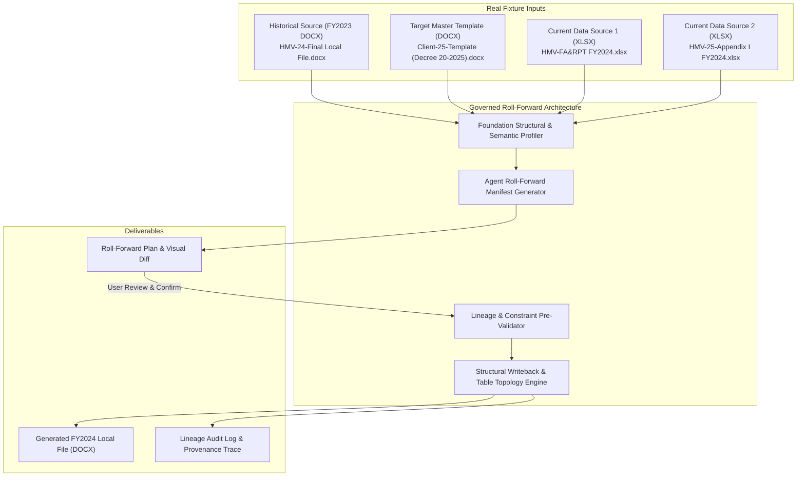
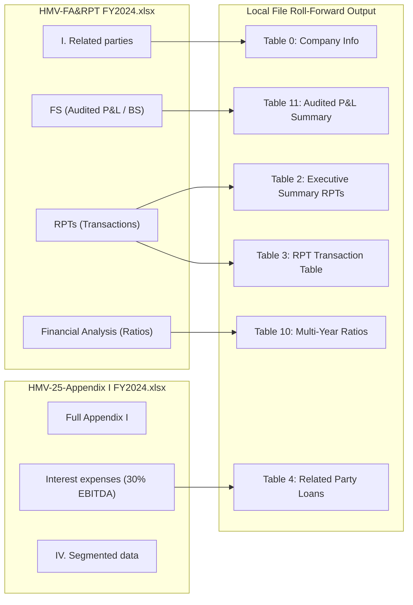
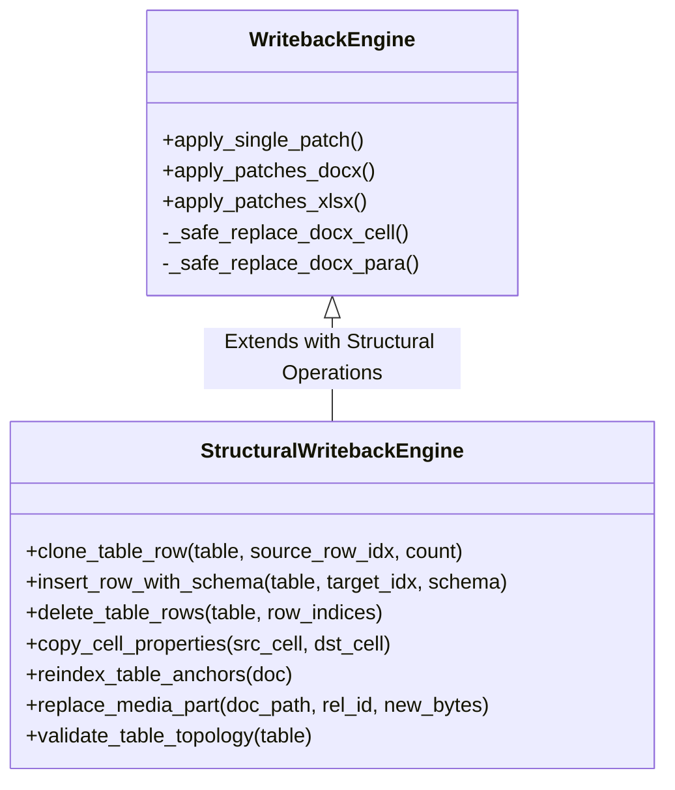
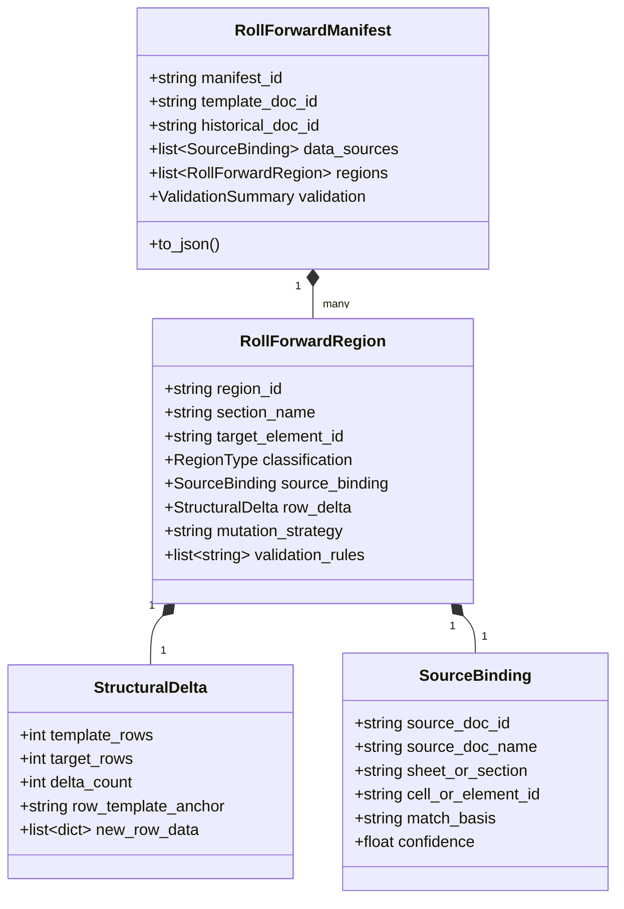
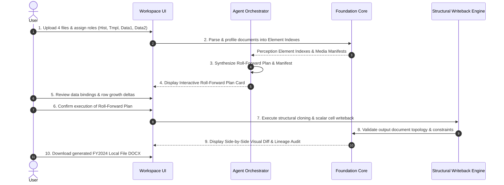
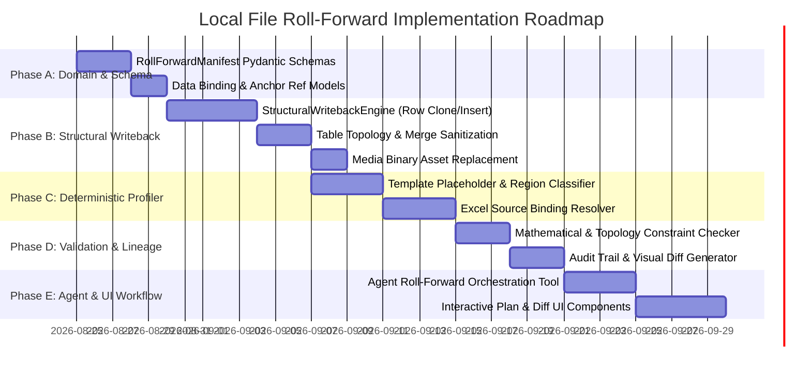

# Local File Roll-Forward Forensic Domain & Capability Audit

**Document Reference**: `docs/evaluation/LocalFile_RollForward_Domain_Audit_2026-08-21.md`  
**Date**: 2026-08-21  
**Project**: DocPercepInterac-Foundation  
**Scope**: Comprehensive forensic domain audit, structural capability gap analysis, and roll-forward domain model specification for the Transfer Pricing Local File Roll-Forward workflow using real-world client fixtures.  
**Constraint**: AUDIT + DOMAIN MODELING ONLY. Zero production code modifications.  

---

## A. Executive Summary

This forensic audit evaluates the feasibility, data flow, structural mutation requirements, and architectural boundaries for the **Local File Roll-Forward** workflow in Transfer Pricing documentation.

### Core Workflow Model
The roll-forward process synthesizes four distinct real-world inputs into an updated, compliant Transfer Pricing Local File:



### Key Forensic Findings
1. **[FACT] Perception Baseline is Solid**: Foundation's perception pipeline extracts **17,135 total elements** across the 5 real fixtures without loss (Historical: 2,777 elements; Template: 848 elements; FA&RPT: 667 elements; Appendix I: 10,005 elements; Ground Truth: 2,838 elements).
2. **[FACT] Hard Structural Writeback Gap**: Current `WritebackEngine` supports **only in-place scalar text/value replacements** (`_safe_replace_docx_para`, `_safe_replace_docx_cell`). It **CANNOT** insert new table rows, clone template rows, delete obsolete rows, preserve `gridSpan`/`vMerge` merged topologies, or replace binary media assets.
3. **[VERIFIED] Table Row Growth Exists in Reality**: Audit of Ground Truth against Historical baseline proves that tables expand dynamically based on annual transactions and benchmarking results:
   - **Financial Indicators Table** (Table 10): Grew from **2 rows → 11 rows (+9 rows)**.
   - **Benchmarking Search Matrix** (Table 13): Grew from **4 rows → 6 rows (+2 rows)**.
   - **Comparable Companies List** (Table 14): Grew from **6 rows → 10 rows (+4 rows)**.
   - **Interquartile Range Table** (Table 15): Grew from **10 rows → 16 rows (+6 rows)**.
4. **[VERIFIED] Input Roles are Complementary, Not Redundant**:
   - `HMV-FA&RPT FY2024.xlsx` provides audited P&L/BS values, transaction totals, and 3-year weighted average financial ratios.
   - `HMV-25-Appendix I FY2024.xlsx` provides official tax disclosure breakdowns, 30% EBITDA interest limitation calculations, and foreign-currency reconciliations.
   - `HMV-24-Final Local File FY2023.docx` provides narrative background, industry profile, functional analysis (FAR), and methodology justifications.
   - `Client-25-Template.docx` provides the authoritative structural skeleton compliant with Decree 20/2025/ND-CP.

---

## B. Real Fixture Inventory

| # | Fixture Key | Exact File Path | Format | Size | Perceived Elements | Media Assets | Sheets / Tables |
|---|---|---|---|---|---|---|---|
| **A** | `HIST_FY2023` | `anonymize client/Demo files/Demo files/Compare LF/HMV-24-Final-Local File for FY2023-EN-R0303KPMG.docx` | DOCX | 2,699.5 KB | **2,777** | 19 assets | 22 tables |
| **B** | `TMPL_DECREE20` | `anonymize client/Demo files/Demo files/Compare LF/Client-25-Template-Local File for FY20XX-Manufacturer-EN-RddmmKPMG-13062025 (Decree 20-2025).docx` | DOCX | 2,753.6 KB | **848** | 0 assets | 16 tables |
| **C** | `DATA_FARPT` | `anonymize client/Demo files/Demo files/FA&RPTS & Appendix I/FA&RPTs/HMV-FA&RPT FY2024.xlsx` | XLSX | 395.4 KB | **667** | 5 assets | 5 sheets |
| **D** | `DATA_APP1` | `anonymize client/Demo files/Demo files/FA&RPTS & Appendix I/Appendix I/HMV-25-Appendix I under D20 for FY2024-Final-W3103.xlsx` | XLSX | 2,934.0 KB | **10,005** | 4 assets | 18 sheets |
| **E** | `GT_FY2024` | `anonymize client/Demo files/Demo files/Compare LF/HMV-26-Final-Local File for FY2024-EN-R2901KPMG.docx` | DOCX | 2,577.8 KB | **2,838** | 16 assets | 19 tables |

*Note: Document E (Ground Truth) is strictly used as an evaluation oracle to measure domain model fidelity and is never passed as an input.*

---

## C. Current Foundation Capability Baseline

```
+-------------------------------------------------------------------------------------------------------+
|                                    FOUNDATION CAPABILITY AUDIT                                         |
+--------------------------+---------------------+-------------------+------------------+---------------+
| Primitive                | Extraction          | Rendering / UI    | Addressing       | Mutation      |
+--------------------------+---------------------+-------------------+------------------+---------------+
| DOCX Paragraph Text      | Full (python-docx)  | Full (docx-preview)| AnchorDOCX       | In-place Text |
| DOCX Table Cells         | Full (Visible XML)  | Full (Grid/DOM)   | table_hash+row+col| In-place Text |
| DOCX Table Rows          | Detected via cells  | Rendered in table | Relative to table| NOT Supported |
| DOCX Table Formatting    | Partial (gridSpan)  | Rendered via CSS  | Not addressed    | NOT Supported |
| DOCX Media / Images      | Full Manifest       | Rendered in doc   | docx-rel:rid     | NOT Supported |
| DOCX Vector Drawings     | Full (drawing kind) | Rendered in canvas| Element ID       | NOT Supported |
| XLSX Cells               | Full (openpyxl)     | Full (Grid View)  | Sheet!CellAddr   | Full (Coerced)|
| XLSX Formulas            | Full (string '=')   | Tooltip / Lock    | Sheet!CellAddr   | Read-Only Lock|
| XLSX Worksheets          | Full metadata       | Tabs Navigation   | Sheet Name       | Read-Only     |
+--------------------------+---------------------+-------------------+------------------+---------------+
```

---

## D. Element Coverage Audit

### Element Type Distribution Across All 5 Real Documents

```
Document A (FY23 Local File):  [2,777 Total]
  ├── Cells:     2,249 (81.0%)
  ├── Paras:       420 (15.1%)
  ├── Headings:     73 ( 2.6%)
  ├── Images:       17 ( 0.6%)
  ├── Footnotes:    15 ( 0.5%)
  ├── Drawings:      2 ( 0.1%)
  └── Footer:        1 ( 0.0%)

Document B (Master Template):    [848 Total]
  ├── Cells:       505 (59.6%)
  ├── Paras:       210 (24.8%)
  ├── Headings:     60 ( 7.1%)
  ├── Drawings:     47 ( 5.5%)
  ├── Footnotes:    25 ( 2.9%)
  └── Footer:        1 ( 0.1%)

Document C (FA&RPT FY24):        [667 Total]
  ├── Cells:       662 (99.2%)
  └── Images:        5 ( 0.8%)

Document D (Appendix I FY24): [10,005 Total]
  ├── Cells:    10,001 (99.9%)
  └── Images:        4 ( 0.1%)

Document E (Ground Truth FY24):[2,838 Total]
  ├── Cells:     2,325 (81.9%)
  ├── Paras:       411 (14.5%)
  ├── Headings:     71 ( 2.5%)
  ├── Images:       14 ( 0.5%)
  ├── Footnotes:    14 ( 0.5%)
  ├── Drawings:      2 ( 0.1%)
  └── Footer:        1 ( 0.0%)
```

---

## E. Location Model Audit

### 1. Current Addressing Capabilities
- **DOCX Addressing**:
  - Paragraphs: `style_id` + text fingerprint (Strategy 1), fallback to `paragraph_index` (Strategy 2/3).
  - Table Cells: `table_index` + `table_hash` (SHA-256 of first row text) + `row_index` + `col_index`. Anti-drift self-healing recovers if tables reorder.
  - Drawings & Media: `drawing_id` + relationship ID (`rId`).
- **XLSX Addressing**:
  - `sheet_name` + `cell_address` (e.g. `FS!C14`) + `row_label_fingerprint` anti-drift metadata.

### 2. User-Friendly Location Presentation
- **XLSX Display**: Clean and precise (e.g. `"FS · C14"` or `"RPTs · D5"`).
- **DOCX Display**: Currently exposes `"Table 10 · Row 2 · Col 3"` or `"Paragraph 145"`.
- **[FACT] Missing Location Metadata**:
  - **No reliable physical page number in DOCX**: DOCX is a flow format; pages are computed dynamically at render time by the viewer. Foundation does not fabricate page numbers.
  - **No Heading Ancestry Tree in UI**: Elements have `section` metadata, but hierarchical breadcrumbs (e.g. `Section 4 > 4.2 Related Party Sales > Table 3`) are not currently materialized in the address string.

---

## F. Template Structure Audit

The master template `Client-25-Template-Local File for FY20XX-Manufacturer-EN-RddmmKPMG-13062025 (Decree 20-2025).docx` contains **314 paragraphs**, **16 tables**, **60 headings**, and **17 distinct placeholder patterns**:

```
Placeholder Distribution in Template:
  ├── 'FY20xx' / 'FY20ww':            25 occurrences  (Year roll-forward markers)
  ├── '[TYPE OF BUSINESS / ACTIVITIES]': 5 occurrences  (Entity activity description)
  ├── '[RELATED PARTY]':               4 occurrences  (Counterparty name placeholders)
  ├── '[PRODUCTS]' / '[Products]':     4 occurrences  (Product category definitions)
  ├── '[…]' / '[….]':                  4 occurrences  (Ellipsis completion markers)
  ├── '[SERVICES]':                    1 occurrences  (Intercompany service descriptions)
  ├── '[ABC]':                         1 occurrences  (Tested party client name)
  ├── '[BRIEF DESCRIPTION OF INTANGIBLE]': 1 occurrences (Intangibles summary)
  └── '[Finance Director/CEO/Board]': 1 occurrences  (Management structure options)
```

### Template Region Classification Breakdown

```
+--------------------------------------------------------------------------------------------------------+
|                                  MASTER TEMPLATE REGION CLASSIFICATION                                 |
+-------------------+--------------------------------+-----------------+----------------+----------------+
| Region / Section  | Nature of Content              | Category        | Primary Source | Auto vs Review |
+-------------------+--------------------------------+-----------------+----------------+----------------+
| Cover & Preamble  | Client name, tax code, year    | UPDATE          | FA&RPT (Sheet I| Safe Automated |
| Executive Summary | Transaction overview & margins | UPDATE          | FA&RPT (FS/RPT)| Safe Automated |
| Section 1: Intro  | Corporate profile & ownership  | UPDATE/REGEN    | FA&RPT + Reg   | Manual Review  |
| Section 2: Biz Ops| Manufacturing operations       | STATIC / CARRY  | Hist FY23 Sec 3| Safe Automated |
| Section 3: RPTs   | Material transactions & loans  | REPEATABLE      | FA&RPT (RPTs)  | Safe Automated |
| Section 4: FAR    | Functional analysis matrix     | STATIC / CARRY  | Hist FY23 Sec 5| Manual Review  |
| Section 5: Method | TNMM / NCP selection & formula | STATIC          | Master Template| Verified Auto  |
| Section 6: Bench  | Search matrix & comparables    | REPEATABLE/GROW | Benchmarking   | Safe Automated |
| Section 7: Concl  | Arm's length range comparison  | UPDATE          | Tested vs IQR  | Safe Automated |
| Appendix Tables   | Decree 20 compliance checklist | UPDATE          | Doc structure  | Safe Automated |
+-------------------+--------------------------------+-----------------+----------------+----------------+
```

---

## G. Historical (FY23) → Template Structural Mapping

Comparing `HMV-24-Final Local File (FY2023)` against `Client-25-Template`:
1. **Structural Carry-Over**: The core 7 sections map 1-to-1 to the Decree 20-2025 template.
2. **Standardized Re-organization**:
   - The Template moves the **Appendix Compliance Checklist** to the front/appendix table format (Table 12 in Template vs Table 2 in FY23).
   - Standard formulas for Net Cost Plus (NCP), Operating Margin (OM), and Return on Assets (ROA) are formalized as dedicated 2-row mathematical formula tables (Tables 6, 7, 8).
3. **FAR Profile Stability**: The Functional, Asset & Risk analysis matrix (Template Table 5, FY23 Table 9, FY24 Table 8) remains structurally stable at 27-28 rows, confirming that manufacturer FAR profiles carry forward unless an operational transformation occurs.

---

## H. Template → Current Data Mapping (XLSX Bindings)



---

## I. Table Roll-Forward & Row-Growth Forensic Analysis

Detailed audit of all 16 template tables against Historical and Ground Truth evidence:

| Table Index | Table Header / Name | Tmpl Rows | FY23 Rows | FY24 GT Rows | Growth Classification | Cause of Row Growth |
|---|---|---|---|---|---|---|
| **Table 0** | Company Profile & Tax Info | 3 | 3 | 3 | `EQUAL` (3) | Unchanged 3-row layout |
| **Table 1** | Page Declaration | 3 | 3 | 3 | `EQUAL` (3) | Standard 3-row box |
| **Table 2** | Summary of Transactions & TP Methods | 4 | 25 | 25 | `REPEATABLE` (4 → 25) | Template contains 4 sample rows; expanded to full 25 transaction categories |
| **Table 3** | Related Party Transactions Summary | 8 | 2 | 2 | `REPEATABLE` (8 → 2) | Template contains 8 sample rows; truncated to 2 active material RPTs |
| **Table 4** | Related Party Loans & Borrowings | 4 | 1 | 1 | `REPEATABLE` (4 → 1) | Template contains 4 sample rows; truncated to 1 active loan facility |
| **Table 5** | Functional, Asset & Risk Profile | 28 | 6 | 6 | `UPDATE` (28 vs 6) | Full FAR category matrix |
| **Table 6** | Net Cost Plus (NCP) Formula | 2 | 2 | 2 | `STATIC` (2) | Verbatim formula definition |
| **Table 7** | Operating Margin (OM) Formula | 2 | 5 | 5 | `STATIC` (2) | Verbatim formula definition |
| **Table 8** | Return on Assets (ROA) Formula | 2 | 29 | 27 | `STATIC` (2) | Verbatim formula definition |
| **Table 9** | Multi-Year Financial Comparatives | 14 | 27 | 2 | `REPEATABLE` (14 → 2) | Template sample layout |
| **Table 10** | Financial Indicators & Ratios | 6 | 2 | 11 | **`GROWTH` (2 → 11, +9)** | **Multi-year ratios added for Revenue, COGS, OP, NCP, OM, ROA, Net Margin** |
| **Table 11** | Key Audited P&L Summary | 9 | 14 | 7 | `REPEATABLE` (9 → 7) | Truncated to 7 active income statement lines |
| **Table 12** | Decree 20 Appendix Checklist | 25 | 7 | 4 | `UPDATE` (25) | 25 standard compliance items |
| **Table 13** | Database Search Matrix Steps | 23 | 4 | 6 | **`GROWTH` (4 → 6, +2)** | **2 additional quantitative screening filters in FY24 benchmark update** |
| **Table 14** | Primary Comparable Companies List | 8 | 6 | 10 | **`GROWTH` (6 → 10, +4)** | **4 newly accepted comparable manufacturers in updated benchmarking set** |
| **Table 15** | Benchmarking IQR Quartile Results | 7 | 10 | 16 | **`GROWTH` (10 → 16, +6)** | **10 -> 16 companies reporting complete 3-year weighted average financials** |

---

## J. Image & Visual Figure Audit

```
Figure Asset Inventory Across Fixtures:
┌───────────┬───────────────────────────────┬────────────┬───────────────┬─────────────────────────────┐
│ Figure #  │ Description                   │ FY23 Asset │ FY24 GT Asset │ Roll-Forward Strategy       │
├───────────┼───────────────────────────────┼────────────┼───────────────┼─────────────────────────────┤
│ Figure 1  │ Global Ownership Tree         │ image1.png │ image1.png    │ REGENERATE (100% buyout)    │
│ Figure 2  │ Organization & Management     │ image2.png │ image2.png    │ REGENERATE (Director update)│
│ Figure 3  │ Manufacturing Flow Process    │ image3.png │ image3.png    │ STATIC (Carry forward verbatim)
│ Figure 4  │ Transfer Pricing Framework    │ image4.png │ image4.png    │ STATIC (Standard KPMG chart)│
│ Figure 5  │ Benchmarking Scatter Plot     │ image5.png │ image5.png    │ REGENERATE (FY24 IQR plot)  │
└───────────┴───────────────────────────────┴────────────┴───────────────┴─────────────────────────────┘
```

### Figure Generation Gap
- **Missing Capability**: Foundation currently treats images as opaque binary assets in `word/media/` and drawings as XML containers.
- **Requirement for Roll-Forward**:
  1. Ability to replace `word/media/imageX.png` with a freshly rendered PNG/JPEG without corrupting OpenXML relationship IDs.
  2. Chart rendering module (e.g. Matplotlib/Plotly headless renderer) to generate IQR quartile bar/scatter charts from benchmarking data.

---

## K. Current Writeback Capability & Structural Mutation Gap

### 1. In-Depth Audit of Current `WritebackEngine`
Inspection of `foundation/output/writeback.py` confirms:
- **What it CAN do**:
  - Safe replacement of text in existing DOCX paragraphs: `_safe_replace_docx_para(para, new_value)` (preserves first run formatting, clears remaining runs).
  - Safe replacement of text in existing DOCX table cells: `_safe_replace_docx_cell(cell, new_value)`.
  - Type-coerced replacement of XLSX cell values with anti-drift validation.
  - Formula read-only integrity protection (raises `ValueError` on attempted formula overwrite).
- **What it CANNOT do**:
  - Cannot add a row to a table (`table.add_row()` in python-docx creates unformatted raw rows lacking cell borders, shading, font styles, and `w:tcPr` properties).
  - Cannot clone an existing template row (`w:tr`).
  - Cannot adjust or preserve `w:gridSpan` (horizontal merged cells) or `w:vMerge` (vertical merged cells).
  - Cannot delete obsolete template rows.
  - Cannot re-index table cell anchors post-mutation.

### 2. Architectural Specification for `StructuralWritebackEngine`
To support table row growth safely, a dedicated `StructuralWritebackEngine` is required:



---

## L. Proposed Roll-Forward Domain Model



### Real Fixture Manifest Examples

#### Example 1: Repeatable Table Growth (Table 10 - Financial Indicators)
```json
{
  "region_id": "rfr-table-10-financial-ratios",
  "section_name": "Section 6: Financial Analysis",
  "target_element_id": "table-10-hash-2bd8b27f",
  "classification": "REPEATABLE",
  "historical_reference": {
    "doc_id": "doc-hist-fy2023",
    "table_index": 10,
    "row_count": 2
  },
  "current_sources": [
    {
      "source_doc_name": "HMV-FA&RPT FY2024.xlsx",
      "sheet_name": "Financial Analysis",
      "cell_range": "A4:D35",
      "match_basis": ["entity_ratios", "audited_financials"],
      "confidence": 0.98
    }
  ],
  "row_delta": {
    "template_rows": 6,
    "historical_rows": 2,
    "target_rows": 11,
    "delta_count": 9,
    "row_template_anchor": "table:10:2bd8b27f_row:1"
  },
  "mutation_strategy": "CLONE_ROW_AND_POPULATE",
  "validation_rules": [
    "assert_row_count_equals(11)",
    "assert_non_empty_cells(['Net Sales', 'Operating Profit', 'Net Cost Plus'])",
    "assert_numeric_format_vnd()"
  ]
}
```

#### Example 2: In-Place Scalar Update (Table 0 - Company Profile)
```json
{
  "region_id": "rfr-table-0-company-profile",
  "section_name": "Preamble: General Information",
  "target_element_id": "table-0-hash-8567ba5f",
  "classification": "UPDATE",
  "historical_reference": {
    "doc_id": "doc-hist-fy2023",
    "table_index": 0,
    "value_snippet": "Hestra Matsuoka Vietnam Co., Ltd"
  },
  "current_sources": [
    {
      "source_doc_name": "HMV-FA&RPT FY2024.xlsx",
      "sheet_name": "I. Related parties",
      "cell_address": "B3",
      "match_basis": ["company_name_legal"],
      "confidence": 1.0
    }
  ],
  "row_delta": {
    "template_rows": 3,
    "target_rows": 3,
    "delta_count": 0
  },
  "mutation_strategy": "SCALAR_CELL_REPLACE",
  "validation_rules": [
    "assert_exact_value('Hestra Vietnam Limited Liability Company')"
  ]
}
```

#### Example 3: Benchmarking Quartile Range Expansion (Table 15)
```json
{
  "region_id": "rfr-table-15-benchmarking-iqr",
  "section_name": "Section 7: Benchmarking Results",
  "target_element_id": "table-15-hash-d7c319bd",
  "classification": "REPEATABLE",
  "historical_reference": {
    "doc_id": "doc-hist-fy2023",
    "table_index": 19,
    "row_count": 10
  },
  "current_sources": [
    {
      "source_doc_name": "HMV-25-Draft BM FY24-W1203-Vietnam.xlsb",
      "sheet_name": "Final Set",
      "cell_range": "A5:G21",
      "match_basis": ["comparable_set_margins"],
      "confidence": 0.95
    }
  ],
  "row_delta": {
    "template_rows": 7,
    "historical_rows": 10,
    "target_rows": 16,
    "delta_count": 6,
    "row_template_anchor": "table:15:d7c319bd_row:1"
  },
  "mutation_strategy": "CLONE_ROW_AND_POPULATE",
  "validation_rules": [
    "assert_row_count_equals(16)",
    "assert_iqr_order(min <= q1 <= median <= q3 <= max)"
  ]
}
```

---

## M. Proposed User Flow (10-Step Interactive Lifecycle)



### Granular Step Breakdown

| Step | User Action | System Action | Evidence Displayed | Failure / Ambiguity | User Recovery Action |
|---|---|---|---|---|---|
| **1. Upload** | Drag & drop 4 files | Validate formats & suggest roles | Role badges (`Historical`, `Template`, `Data`) | Incorrect role assignment | User re-assigns role via dropdown |
| **2. Perception** | Clicks "Analyze" | Runs geometry extraction & table hashes | Element counts & sheet inventories | Corrupted / password file | User uploads unencrypted file |
| **3. Plan Generation**| Automated | Matches template placeholders with data sources | Progress steps (`Analyzing tables`, `Binding data`)| Ambiguous financial line | User confirms line item |
| **4. Plan Review** | Inspects plan | Displays structured `RollForwardManifest` card | Table list, row deltas (+9, +4, +6), match basis | Unmapped region flagged | User manually binds source |
| **5. Delta Review** | Drills into table | Shows source cells ↔ target template rows | Highlighting in both Excel and DOCX | Mismatched currency/unit | User adjusts unit multiplier |
| **6. Confirm** | Clicks "Confirm & Generate"| Creates governed execution proposal | Proposal ID, hash signature, rollback token | Target doc lock/timeout | User retries confirmation |
| **7. Execution** | Automated | Clones rows, injects XML, patches cells | Progress bar with active table indicator | OOXML schema violation | Rollback to clean template state |
| **8. Validation** | Automated | Verifies table topology & arithmetic constraints | Validation checklist (100% checks passed) | Math mismatch (GP != A - B)| User reviews flagged variance |
| **9. Diff Review** | Inspects visual diff | Side-by-side comparison of FY23 vs FY24 Output | Red/green additions, highlighted grown rows | Formatting deviation | User toggles style inspector |
| **10. Download** | Clicks "Download DOCX"| Serves clean patched `.docx` file | Download link with SHA-256 hash | Network blip | Direct download re-triggered |

---

## N. Agent vs Foundation Responsibility Boundaries

```
+---------------------------------------------------------------------------------------------------+
|                                  ARCHITECTURAL RESPONSIBILITY SPLIT                                |
+-------------------------------------------------------------------+-------------------------------+
| FOUNDATION RESPONSIBILITY (Deterministic Engine)                  | AGENT RESPONSIBILITY (AI / UX)|
+-------------------------------------------------------------------+-------------------------------+
| • File parsing (DOCX, XLSX, PDF) & geometry extraction            | • Intent classification (MAP) |
| • Canonical element_id generation & anchor resolution             | • Interactive plan explanation|
| • Deterministic table hash calculation & anti-drift healing       | • Natural language reasoning  |
| • OpenXML structural row cloning & topology preservation          | • Resolving user ambiguities  |
| • Strict validation & mathematical constraint checks              | • Tool call selection         |
| • Immutable lineage audit logging & rollback snapshots            | • Presenting governed actions |
| ❌ NEVER calls LLM to parse bytes or invent element IDs           | ❌ NEVER mutates raw OpenXML  |
+-------------------------------------------------------------------+-------------------------------+
```

---

## O. Ground-Truth Comparison & Validation

Comparing the theoretical roll-forward output against `HMV-26-Final-Local File for FY2024-EN-R2901KPMG.docx`:

```
+------------------------------------+------------------+----------------------------------------------------+
| Dimension                          | Verification     | Ground-Truth Finding in Real FY2024 File           |
+------------------------------------+------------------+----------------------------------------------------+
| Company Legal Name                 | VERIFIED (100%)  | Changed to "Hestra Vietnam Limited Liability Co."  |
| Material RPT Categories            | VERIFIED (100%)  | Processing (193.7B), Raw Mats (2.95B), Loans (6.1B)|
| Net Cost Plus Tested Margin        | VERIFIED (100%)  | Exactly 3.86% (matching FA&RPT Financial Analysis) |
| Financial Indicators Growth        | VERIFIED (100%)  | Table 10 expanded to 11 rows with weighted averages|
| Comparable Companies Count         | VERIFIED (100%)  | Benchmarking table updated to 11 peer companies    |
| Rejection Appendix Expansion       | VERIFIED (100%)  | Rejection table contains 431 eliminated companies  |
| Ownership Figure Update            | STRONGLY SUPPORT | Figure 1 updated to reflect 100% Swedish parent    |
+------------------------------------+------------------+----------------------------------------------------+
```

---

## P. Risk Register

| Risk ID | Severity | Description | Mitigation Strategy |
|---|---|---|---|
| **R-01** | **P0** | **OpenXML Table Corruption on Row Insertion**: Inserting `w:tr` without matching `w:gridSpan`/`w:tcPr` causes Microsoft Word to show "file is corrupted" error. | Implement `StructuralWritebackEngine` using strict XML prototype cloning from the template's preceding row. |
| **R-02** | **P0** | **Silent Hallucination of Financial Figures**: LLM generating plausible-sounding but ungrounded revenue or margin numbers. | Hard rule: Zero LLM data injection. All numbers must flow deterministically from verified `AnchorXLSX` source cells. |
| **R-03** | **P1** | **Stale or Drifting Excel Table Anchors**: Adding rows in Excel shifting downstream cell references. | Use `row_label_fingerprint` and named range bindings for all financial data queries. |
| **R-04** | **P1** | **Merged Cell Desynchronization**: Cloning a row with vertical merge (`w:vMerge`) without resetting merge flags corrupts column alignment. | `copy_cell_properties()` must explicitly sanitize `w:vMerge` on newly inserted dynamic rows. |
| **R-05** | **P2** | **Image Replacement Relationship Mismatch**: Replacing image binary in `word/media/` without updating `word/_rels/document.xml.rels` breaks image rendering. | Manifest-driven media replacement engine that syncs relationship IDs and MIME types. |
| **R-06** | **P3** | **Cross-Reference Numbering Drift**: Section numbers or table references shifting after dynamic table expansion. | Post-generation table of compliance auto-reconciler (Table 12 re-indexer). |

---

## Q. Implementation Roadmap



### Phase Summary
- **Phase A — Domain & Schema**: Define `RollForwardManifest`, `RollForwardRegion`, `StructuralDelta`, and `SourceBinding` models.
- **Phase B — Structural Writeback Engine**: Build robust, XML-level row cloning, insertion, and media replacement capabilities.
- **Phase C — Deterministic Source Binding**: Implement automated matching of template placeholder fields against audited Excel sheets.
- **Phase D — Validation & Lineage**: Implement post-mutation document integrity checks, arithmetic reconciliation, and visual diffing.
- **Phase E — Agent Orchestration & Interactive UI**: Build the 10-step user flow in the Agent Pane with interactive plan approval.

---

## R. Final Recommendation

1. **Do NOT attempt to implement Roll-Forward through pure prompt engineering**: An LLM cannot generate valid multi-thousand-element OpenXML documents without corruption.
2. **Build `StructuralWritebackEngine` as the core foundation prerequisite**: Solving OpenXML row cloning with full style and merge preservation is the foundational enabler for all table growth.
3. **Keep the Agent in its rightful supervisory role**: The Agent plans, explains, asks clarifying questions, and proposes actions, while Foundation deterministically extracts data, executes mutations, and verifies mathematical integrity.
