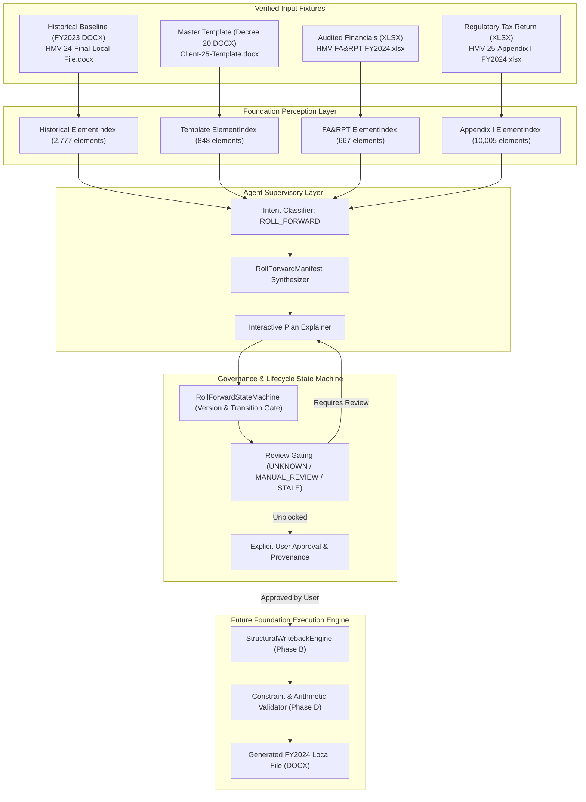
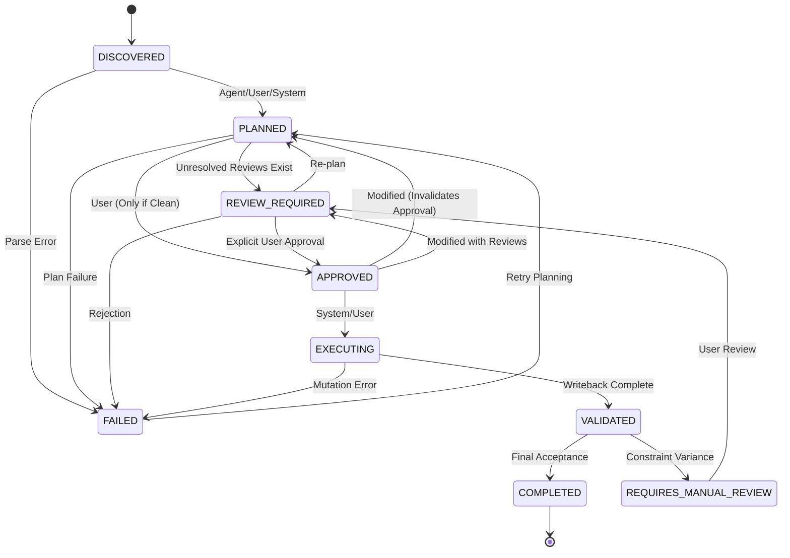

# Local File Roll-Forward Domain Model & Contract (V1 Specification)

**Document Reference**: `docs/evaluation/LocalFile_RollForward_Domain_Model_V1_2026-08-21.md`  
**Date**: 2026-08-21  
**Project**: DocPercepInterac-Foundation  
**Package**: `foundation/applications/rollforward/`  
**Status**: ACTIVE CONTRACT (V1)  
**Constraint**: Domain contract, manifest specification, and lifecycle state machine ONLY. No physical mutation engines (`StructuralWritebackEngine`, DOCX row insertion, image binary replacement).  

---

## A. Domain Purpose & Architecture

The **Local File Roll-Forward** workflow automates the assembly, updating, and verification of Transfer Pricing Local Files compliant with statutory regulations (Decree No. 20/2025/ND-CP).



---

## B. Manifest Schema (`RollForwardManifest`)

The `RollForwardManifest` represents the top-level execution contract. It binds together all regions, figures, validation rules, versioning metadata, and approval provenance.

### Core Data Structure
```python
class RollForwardManifest(BaseModel):
    schema_version: str = "1.0.0"
    manifest_version: int = 1
    parent_version: Optional[int] = None
    manifest_id: str = Field(default_factory=lambda: f"rfm-{uuid.uuid4().hex[:12]}")
    session_id: str
    historical_document_id: Optional[str] = None
    template_document_id: str
    current_source_document_ids: List[str] = Field(default_factory=list)
    status: ManifestStatus = ManifestStatus.DISCOVERED
    regions: List[RollForwardRegion] = Field(default_factory=list)
    figures: List[FigureBinding] = Field(default_factory=list)
    history: List[TransitionLog] = Field(default_factory=list)
    approved_by: Optional[str] = None
    approved_at: Optional[str] = None
    approved_manifest_version: Optional[int] = None
    created_at: str
    updated_at: str
```

### Versioning & Invalidation Invariants
1. **Manifest Versioning**: Every post-creation modification must call `mark_modified()`, incrementing `manifest_version` and setting `parent_version`.
2. **Approval Invalidation**: If a manifest in `APPROVED` status is modified, its approval is immediately invalidated (`approved_by = None`, `approved_manifest_version = None`), and status reverts to `REVIEW_REQUIRED` (if manual reviews exist) or `PLANNED`.
3. **Execution Gating**: `is_execution_ready()` returns `True` **only if**:
   - `status == ManifestStatus.APPROVED`
   - `approved_manifest_version == manifest_version`
   - `approved_by` and `approved_at` are non-empty
   - Every `RollForwardRegion` in `regions` has `execution_gate == ExecutionGate.READY`.

---

## C. Region Schema (`RollForwardRegion`)

A `RollForwardRegion` corresponds to an independently evaluated target area (paragraph, heading, table, or section) in the master template.

```python
class RollForwardRegion(BaseModel):
    region_id: str = Field(default_factory=lambda: f"rfr-{uuid.uuid4().hex[:8]}")
    section_name: str
    target_document_id: str
    target_element_ids: List[str] = Field(default_factory=list)
    classification: RegionClassification = RegionClassification.UPDATE
    historical_reference: Optional[HistoricalReference] = None
    current_sources: List[SourceBinding] = Field(default_factory=list)
    structural_delta: Optional[StructuralDelta] = None
    row_template: Optional[RowTemplate] = None
    validation_rules: List[ValidationRule] = Field(default_factory=list)
    mutation_strategy: str = "IN_PLACE_REPLACE"
    review_state: Literal["PENDING", "APPROVED", "REJECTED", "MANUAL_REQUIRED"] = "PENDING"
    notes: Optional[str] = None
```

### Region Classifications
- `STATIC`: Content/methodology carried over verbatim without modification.
- `UPDATE`: In-place scalar text or cell replacement (preserves row/col topology).
- `REPEATABLE`: Dynamic table expansion (row cloning or insertion) driven by current data.
- `REGENERATE`: Visual diagram or chart replacement (e.g. corporate ownership chart).
- `ADD`: Newly introduced section required by Decree 20-2025.
- `REMOVE`: Obsolete section eliminated from the final report.
- `MANUAL_REVIEW`: High-risk or ambiguous region requiring human tax reviewer input.
- `UNKNOWN`: Unrecognized region; strictly blocked from automated execution.

---

## D. Source Binding (`SourceBinding`)

`SourceBinding` provides dual-format provenance linking target template regions to exact source primitives in DOCX or XLSX files.

```python
class SourceBinding(BaseModel):
    source_doc_id: str
    source_doc_name: str
    source_type: SourceType = SourceType.XLSX
    sheet_name: Optional[str] = None
    cell_address: Optional[str] = None
    cell_range: Optional[str] = None
    element_id: Optional[str] = None       # Canonical Foundation element_id
    match_basis: List[str] = Field(default_factory=list)
    status: SourceBindingStatus = SourceBindingStatus.VERIFIED
    reason: str = ""
    provenance: Dict[str, Any] = Field(default_factory=dict)
```

### Source Binding Statuses
- `VERIFIED`: Binding deterministically confirmed against loaded element index.
- `UNVERIFIED`: Proposed binding not yet confirmed against document structure.
- `AMBIGUOUS`: Multiple matching cells/elements detected; requires disambiguation.
- `STALE`: Source reference shifted or altered post-edit.
- `MISSING`: Target source sheet or element not found in active workspace.

---

## E. Structural Delta (`StructuralDelta`)

`StructuralDelta` explicitly defines topological changes between template skeleton and target output.

```python
class StructuralDelta(BaseModel):
    template_rows: int = Field(ge=0)
    target_rows: int = Field(ge=0)
    insert_count: int = Field(ge=0)
    delete_count: int = Field(ge=0)
    column_delta: int = 0
    merge_topology_changed: bool = False
    row_template_anchor: Optional[str] = None
    observation_source: str = "audit_comparison"
    observation_context: Dict[str, Any] = Field(default_factory=dict)
```

---

## F. Row Template (`RowTemplate`)

`RowTemplate` defines the prototype row structure safe for structural cloning during future execution.

```python
class RowTemplate(BaseModel):
    template_row_idx: int = Field(ge=0)
    row_anchor: str
    column_schemas: List[Dict[str, Any]] = Field(default_factory=list)
    cell_properties_policy: str = "INHERIT_PROTOTYPE"
    merge_policy: str = "RESET_VMERGE_RETAIN_GRIDSPAN"
    safe_to_clone: bool = True
```

> [!IMPORTANT]
> `safe_to_clone: bool` represents structural XML schema validity only. It **never authorizes execution** on its own.

---

## G. Figure Binding (`FigureBinding`)

`FigureBinding` coordinates visual asset replacement without corrupting OpenXML relationship files (`document.xml.rels`).

```python
class FigureBinding(BaseModel):
    figure_id: str = Field(default_factory=lambda: f"fig-{uuid.uuid4().hex[:8]}")
    target_element_id: str
    target_doc_id: str
    historical_reference: Optional[HistoricalReference] = None
    current_source: Optional[SourceBinding] = None
    media_id: Optional[str] = None
    source_ref: Optional[str] = None
    strategy: RegionClassification = RegionClassification.STATIC
    validation_rules: List[ValidationRule] = Field(default_factory=list)
```

---

## H. Validation Rule (`ValidationRule`)

```python
class ValidationRule(BaseModel):
    rule_type: ValidationRuleType
    severity: ValidationSeverity = ValidationSeverity.BLOCKER
    parameters: Dict[str, Any] = Field(default_factory=dict)
    description: str = ""
```

Supported Rule Types:
- `REQUIRED_REGION_PRESENT`: Confirms essential regulatory section exists.
- `ROW_COUNT_MATCH`: Verifies table row count matches expected expansion.
- `COLUMN_COUNT_UNCHANGED`: Guards against accidental column skew.
- `MERGE_TOPOLOGY_PRESERVED`: Ensures `gridSpan` and `vMerge` attributes remain valid.
- `STYLE_PRESERVED`: Verifies table styling, shading, and font attributes.
- `SOURCE_VALUE_PRESENT`: Ensures non-empty source data is mapped.
- `OUTPUT_VALUE_MATCH`: Re-parses output cell to confirm written value.
- `IMAGE_PRESENT`: Verifies replacement image exists in package.
- `NO_ORPHAN_RELATIONSHIPS`: Verifies zero broken relationship IDs in `.rels`.
- `ARITHMETIC_CONSTRAINT`: Checks mathematical consistency (e.g. `GP = Net Sales - COGS`).

---

## I. Roll-Forward Diff (`RollForwardDiff`)

```python
class RollForwardDiff(BaseModel):
    region_id: str
    change_type: DiffChangeType
    before_summary: Dict[str, Any] = Field(default_factory=dict)
    after_summary: Dict[str, Any] = Field(default_factory=dict)
    delta_details: List[Dict[str, Any]] = Field(default_factory=list)
```

---

## J. State Machine & Legal Transition Graph



### Strict Transition Rules
1. **Agent Cannot Approve**: Attempting `transition(manifest, APPROVED, actor="agent")` raises `UnauthorizedApprovalError`.
2. **Review Gating**: If any region has `MANUAL_REVIEW`, `UNKNOWN`, or non-`VERIFIED` sources, `PLANNED -> APPROVED` is rejected (`IllegalTransitionError`); it must route through `REVIEW_REQUIRED`.
3. **Execution Guard**: Attempting `start_execution()` when `status != APPROVED` or `approved_manifest_version != manifest_version` raises `ApprovalInvalidationError`.
4. **Immutable Log**: Every transition appends a `TransitionLog(from_state, to_state, timestamp, actor, reason, manifest_version)`.

---

## K. Approval Model & Provenance

When explicit user approval occurs:
```python
manifest.approved_by = "senior_tax_manager@kpmg.com"
manifest.approved_at = "2026-08-21T05:00:00Z"
manifest.approved_manifest_version = manifest.manifest_version
```
Any subsequent modification to the manifest increments `manifest_version` and clears `approved_by`, `approved_at`, and `approved_manifest_version`.

---

## L. Evidence & Provenance

Every region maintains full traceability:
- **Historical Source**: Previous year's element ID, table index, and text snippet.
- **Current Data Source**: Excel workbook name, worksheet name, cell address / range, and match basis.
- **Target Template Element**: Template table hash, row anchor, and element ID.

---

## M. Real Fixture Examples (Grounded in Audit Data)

### 1. Table 10 Growth (Financial Ratios: 2 → 11 rows, +9 rows)
- **Classification**: `REPEATABLE`
- **Target Table Hash**: `2bd8b27f`
- **Historical Baseline**: Table 10 in `HMV-24-Final Local File.docx` (2 rows)
- **Current Source**: `HMV-FA&RPT FY2024.xlsx` → Sheet `Financial Analysis` → Range `A4:D35`
- **Structural Delta**: `insert_count = 9`, `target_rows = 11`, `row_template_anchor = "table:10:2bd8b27f_row:1"`
- **Ground Truth Status**: `[VERIFIED]` (Matches Ground Truth Table 10 exactly)

### 2. Table 14 Growth (Comparable Companies List: 6 → 10 rows, +4 rows)
- **Classification**: `REPEATABLE`
- **Target Table Hash**: `515cf63c`
- **Current Source**: `HMV-25-Draft BM FY24-W1203.xlsb` → Sheet `Final Set` → Range `A5:F15`
- **Structural Delta**: `insert_count = 4`, `target_rows = 10`, `row_template_anchor = "table:14:515cf63c_row:1"`
- **Ground Truth Status**: `[VERIFIED]`

### 3. Table 15 Growth (Benchmarking IQR Results: 10 → 16 rows, +6 rows)
- **Classification**: `REPEATABLE`
- **Target Table Hash**: `d7c319bd`
- **Current Source**: `HMV-25-Draft BM FY24-W1203.xlsb` → Sheet `Final Set` → Range `A5:G21`
- **Structural Delta**: `insert_count = 6`, `target_rows = 16`, `row_template_anchor = "table:15:d7c319bd_row:1"`
- **Ground Truth Status**: `[VERIFIED]`

### 4. Table 0 Scalar Update (Company Legal Name)
- **Classification**: `UPDATE`
- **Target Table Hash**: `8567ba5f`
- **Historical Text**: `"Hestra Matsuoka Vietnam Co., Ltd"`
- **Current Source**: `HMV-FA&RPT FY2024.xlsx` → Sheet `I. Related parties` → Cell `B3` (`"Hestra Vietnam Limited Liability Company"`)
- **Structural Delta**: `insert_count = 0`, `target_rows = 3`
- **Ground Truth Status**: `[VERIFIED]`

### 5. Figure 1 Diagram Replacement (Corporate Ownership Structure)
- **Classification**: `REGENERATE`
- **Target Element ID**: `fig-01-ownership` (`word/media/image1.png`)
- **Historical Asset**: `image1.png` (50% Matsuoka / 50% Martin Magnusson)
- **Current Source**: `HMV-FA&RPT FY2024.xlsx` → Sheet `I. Related parties` → Cell `B14` (100% Martin Magnusson & CO. AB)
- **Replacement Strategy**: Freshly generated PNG diagram reflecting 100% Swedish parent ownership.
- **Ground Truth Status**: `[STRONGLY_SUPPORTED]`

---

## N. Future StructuralWriteback Contract

The `StructuralWritebackEngine` (scheduled for Phase B) will consume this exact domain contract:
1. `clone_table_row(table, source_row_idx, count)`: Clones `w:tr` elements, copies `w:tcPr` cell formatting, and resets `w:vMerge` attributes.
2. `populate_row_data(table, row_idx, values)`: Writes text into paragraph runs of target cloned cells.
3. `reindex_table_anchors(doc)`: Recomputes table hashes and updates cell element IDs.
4. `replace_media_asset(doc_path, rel_id, new_bytes)`: Updates binary in `word/media/` and preserves relationship references.

---

## O. Out-of-Scope Items for Phase V1

The following capabilities are explicitly out of scope for Phase V1 and deferred to future phases:
- ❌ Physical row insertion or OOXML DOM modification.
- ❌ Binary media file replacement or image generation.
- ❌ Automated mapping inference engine.
- ❌ Agent chat UI components or visual diff renderers.
- ❌ Direct modification of production `WritebackEngine`.
