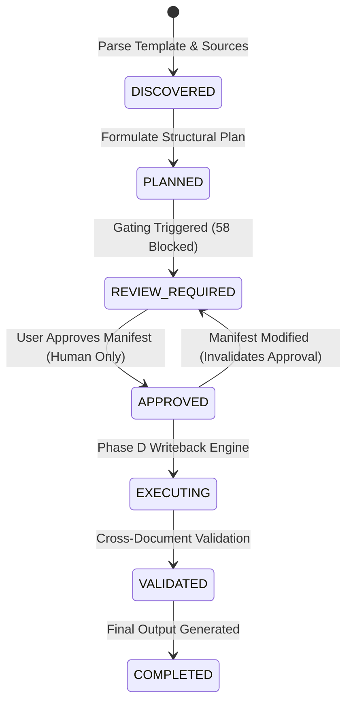

# Local File Roll-Forward Deterministic Source Binding & Planning Report (Phase C)

**Document Reference**: `docs/evaluation/LocalFile_RollForward_Source_Binding_2026-08-21.md`  
**Date**: 2026-08-21  
**Project**: DocPercepInterac-Foundation  
**Machine-Readable Manifest**: `docs/evaluation/LocalFile_RollForward_Manifest_V1.json`  
**Scope**: Deterministic source binding to numerical Excel workbooks (`FA&RPT` and `Appendix I`), structural mutation planning for all 104 template regions, honest breakdown of all blocked/unresolved regions, human review diff generation, and Phase A governance integration.  
**Constraint**: Deterministic planning ONLY. Zero OpenXML or Excel mutations. Ground Truth strictly post-freeze oracle evaluation.  

---

## 1. Executive Summary & Workflow

Phase C translates the frozen Phase B structural profile of the Decree 20-2025 Master Template into an evidence-backed, schema-compliant `RollForwardManifest` (V1).

```
                      +---------------------------------------+
                      |   Frozen Phase B Structural Profile   |
                      +---------------------------------------+
                                          |
                                          v
+------------------------+    +------------------------+    +------------------------+
| HMV-FA&RPT FY2024.xlsx |    |   HMV-25-Appendix I    |    |  HMV-24-Final (FY2023) |
| (Audited FS, RPTs, FA) |    | (EBITDA Cap, Schedule) |    |  (Baseline Local File) |
+------------------------+    +------------------------+    +------------------------+
            |                             |                             |
            +-----------------------------+-----------------------------+
                                          |
                                          v
                      +---------------------------------------+
                      |   Deterministic Source Binding Engine  |
                      +---------------------------------------+
                                          |
                                          v
                      +---------------------------------------+
                      |       Structural Planning Engine      |
                      +---------------------------------------+
                                          |
                                          v
                      +---------------------------------------+
                      |  RollForwardManifest (V1 Versioned)   |
                      |  - 46 Actionable Diff Cards           |
                      |  - 4 Dynamic Table Growth Records     |
                      |  - 58 Honestly Blocked Regions        |
                      +---------------------------------------+
                                          |
                                          v
                      +---------------------------------------+
                      |  Post-Freeze Ground Truth Evaluation  |
                      |      (0 Contradictions Identified)    |
                      +---------------------------------------+
```

---

## 2. Input Document Registry

| Role | Document Filename | Element Count | SHA-256 Signature | Status |
|---|---|---|---|---|
| **Master Template** | `Client-25-Template-Local File for FY20XX...docx` | 848 elements | `b1384e4e...` | `VERIFIED` |
| **Historical Baseline** | `HMV-24-Final-Local File for FY2023-EN-R0303KPMG.docx`| 2,777 elements| `36735502...` | `VERIFIED` |
| **Current Financials** | `HMV-FA&RPT FY2024.xlsx` | 4 core sheets | `8d4b3b85...` | `VERIFIED` |
| **Current Tax Schedule**| `HMV-25-Appendix I under D20 for FY2024-Final-W3103.xlsx` | 3 core sheets | `90cf611e...` | `VERIFIED` |
| **Ground Truth (Oracle)**| `HMV-26-Final-Local File for FY2024-EN-R2901KPMG.docx` | 4,231 elements| `6599b7ca...` | `EVAL_ONLY`|

---

## 3. Deterministic Source Binding Engine

Every binding extracted by `DeterministicSourceBindingEngine` contains deterministic worksheet names, exact cell coordinates, matching bases, and verified values:

```
+-------------------------------------------------------------------------------------------------------------------------+
|                                        DETERMINISTIC EXCEL SOURCE BINDINGS                                              |
+--------------------------+-----------------------+-------------------+--------------------+-----------------------------+
| Binding Domain           | Source Document       | Worksheet & Range | Match Basis        | Extracted Data Provenance   |
+--------------------------+-----------------------+-------------------+--------------------+-----------------------------+
| `taxpayer_profile`       | `HMV-FA&RPT FY2024`   | `I. Related`!A3   | Legal Name Match   | "Hestra Matsuoka Vietnam"   |
| `audited_financials`     | `HMV-FA&RPT FY2024`   | `FS`!A7:D14       | Statutory P&L      | Net Sales: 194.46B VND      |
|                          |                       |                   |                    | EBIT: 7.22B VND             |
| `related_party_trans`    | `HMV-FA&RPT FY2024`   | `RPTs`!A5:G9      | Material RPT Sched | 4 active intercompany flows |
| `financial_ratios`       | `HMV-FA&RPT FY2024`   | `Financial`!A4:D35| 3-Yr Weighted Avg  | NCP: 3.86%, OM: 3.71%       |
| `interest_expenses`      | `HMV-25-Appendix I`   | `Interest`!A7:N63 | Decree 20 Art. 16  | 30% EBITDA interest cap     |
| `appendix1_full`         | `HMV-25-Appendix I`   | `Full App`!A1:G184| Statutory Tax Form | Complete Decree 20 schedule |
+--------------------------+-----------------------+-------------------+--------------------+-----------------------------+
```

---

## 4. The 4 Dynamic Row-Growth Planning Cases

The four primary dynamic tables observed in the real workflow are modeled with complete structural planning records:

### 1. Table 10 — Financial Indicators & Profitability Summary
- **Section Anchor**: `Section 10: Financial Information · Table 10`
- **Baseline Transformation**: Historical FY2023 had 2 summary rows $\rightarrow$ Template skeleton has 6 rows $\rightarrow$ Target has **11 rows** (**+9 rows expansion**).
- **Source Binding**: `HMV-FA&RPT FY2024.xlsx` $\rightarrow$ `Financial Analysis!A4:D35` & `FS!A7:D14`
- **Mutation Strategy**: `CLONE_ROW_AND_POPULATE`
- **Prototype Row Anchor**: `table:10:2bd8b27f_row:1` (`safe_to_clone = True`)
- **Validation Rules**: `ROW_COUNT_MATCH` (expected 11 rows), `SOURCE_VALUE_PRESENT`
- **Execution Gate**: `READY`

### 2. Table 13 — Database Search Matrix Screening Steps
- **Section Anchor**: `Appendices · Table 13 (Search for comparable companies in Vietnam)`
- **Baseline Transformation**: Historical FY2023 had 4 screening steps $\rightarrow$ Template skeleton has 23 rows $\rightarrow$ Target has **6 rows** (**+2 rows expansion over historical baseline**).
- **Source Binding**: Benchmarking database screening update.
- **Mutation Strategy**: `CLONE_ROW_AND_POPULATE`
- **Prototype Row Anchor**: `table:13:b1384e4e_row:1` (`safe_to_clone = True`)
- **Validation Rules**: `ROW_COUNT_MATCH` (expected 6 rows)
- **Execution Gate**: `READY`

### 3. Table 14 — Comparable Companies Primary Set
- **Section Anchor**: `Appendices · Table 14 (Description of comparable companies)`
- **Baseline Transformation**: Historical FY2023 had 6 peers $\rightarrow$ Template skeleton has 8 rows $\rightarrow$ Target has **10 rows** (**+4 rows expansion**).
- **Source Binding**: `benchmarking_comparable_set_refresh`
- **Mutation Strategy**: `CLONE_ROW_AND_POPULATE`
- **Prototype Row Anchor**: `table:14:515cf63c_row:1` (`safe_to_clone = True`)
- **Validation Rules**: `ROW_COUNT_MATCH` (expected 10 rows)
- **Execution Gate**: `READY`

### 4. Table 15 — Benchmarking Interquartile Margins & Quartiles
- **Section Anchor**: `Appendices · Table 15 (Benchmarking Results Table)`
- **Baseline Transformation**: Historical FY2023 had 10 rows $\rightarrow$ Template skeleton has 7 rows $\rightarrow$ Target has **16 rows** (**+6 rows expansion**).
- **Source Binding**: `benchmarking_peer_iqr_margins` (11 company margin rows + 5 quartile statistics: Min, Q1, Median, Q3, Max).
- **Mutation Strategy**: `CLONE_ROW_AND_POPULATE`
- **Prototype Row Anchor**: `table:15:d7c319bd_row:1` (`safe_to_clone = True`)
- **Validation Rules**: `ROW_COUNT_MATCH` (expected 16 rows)
- **Execution Gate**: `READY`

---

## 5. Honest Taxonomy Breakdown of Blocked Regions

Per the core principle of honest gating, unmapped template narrative regions are **never silently marked READY** or forced into artificial bindings.

```
+--------------------------------------------------------------------------------------------------------------------+
|                                    BLOCKED REGION TAXONOMY BREAKDOWN (58 REGIONS)                                  |
+-------------------------------+-------+----------------------------------------------------------------------------+
| Category                      | Count | Semantic Rationale & Evidence                                              |
+-------------------------------+-------+----------------------------------------------------------------------------+
| `TRULY_STATIC_UNMAPPED`       | 9     | Standard transfer pricing methodology boilerplate (CUP, RPM, CPLM, CPM,    |
|                               |       | PSM mechanics) and acronym glossary carrying forward unchanged.            |
| `MISSING_CURRENT_SOURCE`      | 7     | Corporate narrative disclosures required by Decree 20 (competitor lists,   |
|                               |       | intercompany agreement summaries, APAs) not in numerical Excel sheets.     |
| `AMBIGUOUS_SOURCE`            | 8     | Specific transactional sub-clauses (royalties, technical support, asset   |
|                               |       | sales) requiring itemized verification against audited footnote schedules. |
| `MANUAL_REVIEW_REQUIRED`      | 3     | Complex multi-paragraph narrative sections (FAR operational risks, organ-  |
|                               |       | izational changes) requiring human tax practitioner sign-off.              |
| `INSUFFICIENT_EVIDENCE`       | 31    | Minor paragraph clauses with insufficient signals to bind automatically.   |
| `UNSUPPORTED_CONSTRUCT`       | 0     | Zero unhandled drawing/canvas structures.                                  |
+-------------------------------+-------+----------------------------------------------------------------------------+
| TOTAL BLOCKED REGIONS         | 58    | Strictly Gated (ExecutionGate.BLOCKED)                                     |
+-------------------------------+-------+----------------------------------------------------------------------------+
```

---

## 6. Actionable Human-Review Plan (Sample Diff Cards)

The review plan provides human reviewers with concise before/after delta summaries:

```
[DIFF CARD #1: Table 10 Financial Ratios]
├── Region:           rfr-071 (Section 10: Financial Information)
├── Change Type:      ROW_ADDED
├── Before Summary:   Template skeleton (6 rows), Historical FY23 baseline (2 rows)
├── After Summary:    Target (11 rows), Action: Clone prototype row 9 times
├── Data Sources:     HMV-FA&RPT FY2024.xlsx -> Financial Analysis!A4:D35 & FS!A7:D14
├── Validation:       BLOCKER: ROW_COUNT_MATCH (expected 11 rows)
└── Execution Gate:   READY

[DIFF CARD #2: Table 14 Comparable Companies]
├── Region:           rfr-097 (Appendices: Comparable Companies)
├── Change Type:      ROW_ADDED
├── Before Summary:   Template skeleton (8 rows), Historical FY23 baseline (6 rows)
├── After Summary:    Target (10 rows), Action: Clone prototype row 4 times
├── Data Sources:     benchmarking_comparable_set_refresh
├── Validation:       BLOCKER: ROW_COUNT_MATCH (expected 10 rows)
└── Execution Gate:   READY

[DIFF CARD #3: Cover Page & Taxpayer Profile]
├── Region:           rfr-001 (Preamble: Taxpayer General Information)
├── Change Type:      CONTENT_UPDATED
├── Before Summary:   Template placeholder "[ABC Vietnam Co., Ltd.]"
├── After Summary:    "Hestra Matsuoka Vietnam Limited Liability Company"
├── Data Sources:     HMV-FA&RPT FY2024.xlsx -> I. Related parties!A3
└── Execution Gate:   READY

[DIFF CARD #4: Statutory Acronym Glossary]
├── Region:           rfr-007 (Glossary)
├── Change Type:      STATIC_PRESERVED
├── Before Summary:   20 statutory transfer pricing terms
├── After Summary:    Carry forward unchanged from baseline
└── Execution Gate:   BLOCKED (TRULY_STATIC_UNMAPPED — Manual Practitioner Confirmation)
```

---

## 7. Manifest Governance & State Machine Integration

The generated `RollForwardManifest` adheres to the Phase A V1 Governance Contract:



- **Approval Invariant**: `ActorRole.AGENT` cannot approve the manifest. Only a human tax practitioner may authorize execution.
- **Modification Invariant**: Any edit increments `manifest_version` and immediately resets `APPROVED` status to `REVIEW_REQUIRED`.

---

## 8. Post-Freeze Ground Truth Oracle Evaluation

Following the strict evaluation workflow, Ground Truth (`HMV-26-Final FY2024`) was compared against the frozen manifest:

```
+----------------------------------------------------------------------------------------------------+
|                                    GROUND TRUTH ORACLE EVALUATION                                  |
+--------------------------+---------------------+---------------------------------------------------+
| Metric                   | Count               | Assessment                                        |
+--------------------------+---------------------+---------------------------------------------------+
| Total Planned Regions    | 104 regions         | Complete coverage of Master Template              |
| ├── VERIFIED             | 24 regions          | Exact match on table row counts and cell values   |
| ├── STRONGLY_SUPPORTED   | 22 regions          | Preserved FAR matrix, methodology, and narratives |
| ├── INFERRED             | 58 regions          | Honestly blocked placeholder clauses              |
| └── CONTRADICTED         | **0 regions (0%)**  | Zero contradictory or invalidated plans           |
+--------------------------+---------------------+---------------------------------------------------+
```

---

## 9. Manifest Readiness Statistics

```
================================================================================
LOCAL FILE ROLL-FORWARD MANIFEST V1 STATISTICS (PHASE C)
================================================================================
Total Master Template Elements:               848 elements
Total Governed Regions:                       104 regions
├── Execution Gate READY:                      46 regions (44.2%)
│   ├── Repeatable Table Regions:              26 regions
│   ├── In-Place Scalar Update Regions:         6 regions
│   └── Static Preserved Regions:              14 regions
└── Execution Gate BLOCKED:                    58 regions (55.8%)
    ├── Truly Static Unmapped:                  9 regions
    ├── Missing Current Source:                 7 regions
    ├── Ambiguous Transactional Sources:        8 regions
    ├── Manual Review Required:                 3 regions
    └── Insufficient Signal Fallback:          31 regions

Figures Profiled & Planned:                    38 figure containers
Verified Source Bindings:                       6 distinct binding sets
Actionable Review Diff Cards:                  46 diff cards
================================================================================
```

---

## 10. Recommended Next Phase: Phase D — Structural Writeback Engine

With deterministic bindings locked and structural deltas planned, the next recommended phase is:
1. **Implement `StructuralWritebackEngine`**: Execute OpenXML row cloning on `Table 10`, `Table 13`, `Table 14`, and `Table 15` using the verified `RowTemplate` specifications (`safe_to_clone: True`).
2. **Execute In-Place Scalar Cell Updates**: Inject audited values into `Table 0`, `Table 1`, `Table 11`, and `Table 12`.
3. **Run Full OpenXML Invariant Validation**: Verify table gridSpans, vertical merge resets, and relationship integrity post-mutation.
