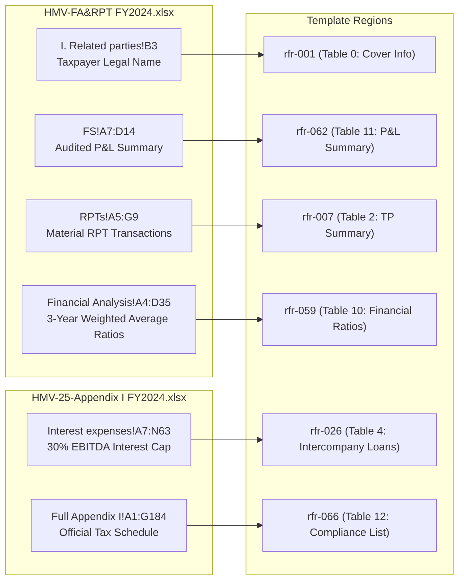

# Local File Roll-Forward Template & Region Profiling Report (Phase B)

**Document Reference**: `docs/evaluation/LocalFile_RollForward_Template_Profile_2026-08-21.md`  
**Date**: 2026-08-21  
**Project**: DocPercepInterac-Foundation  
**Machine-Readable Companion**: `docs/evaluation/LocalFile_RollForward_Template_Profile_2026-08-21.json`  
**Scope**: Deterministic structural segmentation, table signature profiling, row template detection, figure contextual categorization, historical correlation, and current Excel data source discovery for the 848-element Decree 20-2025 Master Template.  
**Constraint**: Deterministic profiling and post-profiling oracle evaluation ONLY. Zero OpenXML or document mutations.  

---

## A. Template Inventory

The target template fixture `Client-25-Template-Local File for FY20XX-Manufacturer-EN-RddmmKPMG-13062025 (Decree 20-2025).docx` represents the master structural skeleton compliant with Decree No. 20/2025/ND-CP.

```
+----------------------------------------------------------------------------------------------------+
|                                    TEMPLATE INVENTORY SUMMARY                                      |
+--------------------------+---------------------+---------------------------------------------------+
| Metric                   | Count               | Notes                                             |
+--------------------------+---------------------+---------------------------------------------------+
| File Size                | 2,753.6 KB          | DOCX Package                                      |
| Total Perceived Elements | 848 elements        | Full perception geometry layer                    |
| ├── Table Cells          | 505 (59.6%)         | 16 distinct OpenXML tables                        |
| ├── Body Paragraphs      | 210 (24.8%)         | Narrative clauses and placeholder statements      |
| ├── Heading Elements     | 60 (7.1%)           | Heading 1, Heading 2, Heading 3 hierarchy         |
| ├── Drawing Containers   | 47 (5.5%)           | Image/figure containers and canvas shapes         |
| ├── Footnotes            | 25 (2.9%)           | Statutory references (Decree 132 / Decree 20)     |
| └── Footers              | 1 (0.1%)            | Standard KPMG confidentiality footer              |
| Template Structural Hash | `b1384e4e...`       | Deterministic multi-table composite signature     |
+--------------------------+---------------------+---------------------------------------------------+
```

---

## B. Region Segmentation

Using the deterministic `TemplateRegionSegmenter`, the 848 flat elements are grouped into **81 semantic, hierarchical regions** based on Word heading hierarchies (`Heading 1`, `Heading 2`, `Heading 3`, regex section anchors), paragraph blocks, drawing containers, and table boundaries.

```
Template Semantic Region Breakdown (Top Major Sections):
  ├── PREAMBLE: General Information & Cover Page (Tables 0 & 1)
  ├── Section 1: Objective & Statutory Scope
  ├── Section 2: Executive Summary & Summary of RPTs (Table 2)
  ├── PART A: Taxpayer Information
  │    ├── Section 3: Overview of the Group & Tested Party (ABC)
  │    ├── Section 4: Organization & Management Structure (Figures 1 & 2)
  │    └── Section 5: Business Strategy & Manufacturing Operations
  ├── PART B: Information on Taxpayer's Related Party Transactions
  │    ├── Section 6: Related Party Transactions Overview (Table 3)
  │    ├── Section 7: Intercompany Loans & Interest Payments (Table 4)
  │    └── Section 8: Analysis of Functions, Assets & Risks (FAR Profile - Table 5)
  ├── Section 9: Economic Analysis & TP Method Selection (Tables 6, 7, 8)
  ├── Section 10: Financial Information & Multi-Year Indicators (Tables 9, 10, 11)
  └── Appendices: Search Matrix, Comparables, and Decree 20 Checklist (Tables 12, 13, 14, 15)
```

---

## C. Classification Matrix

Each identified region received an evidence-based classification adhering to the Phase A V1 Domain Contract:

| Region Identifier | Section Name / Structural Anchor | Elements | Tables Profiled | Classification | Mutation Strategy | Execution Gate |
|---|---|---|---|---|---|---|
| `rfr-001` | Preamble: Taxpayer Profile | 12 | Table 0, Table 1 | `UPDATE` | `SCALAR_CELL_REPLACE` | `READY` |
| `rfr-007` | Executive Summary | 28 | Table 2 | `REPEATABLE` | `CLONE_ROW_AND_POPULATE` | `READY` |
| `rfr-019` | RPT Transactions Overview | 34 | Table 3 | `REPEATABLE` | `CLONE_ROW_AND_POPULATE` | `READY` |
| `rfr-026` | Intercompany Loans & Financing | 22 | Table 4 | `REPEATABLE` | `CLONE_ROW_AND_POPULATE` | `READY` |
| `rfr-031` | FAR Profile Matrix | 86 | Table 5 | `STATIC` | `CARRY_FORWARD_FAR_MATRIX`| `READY` |
| `rfr-053` | Profit Level Indicator Formulas | 18 | Tables 6, 7, 8 | `STATIC` | `PRESERVE_FORMULA_DEF` | `READY` |
| `rfr-058` | Standard Arm's Length Range | 15 | Table 9 | `REPEATABLE` | `CLONE_ROW_AND_POPULATE` | `READY` |
| `rfr-059` | Multi-Year Financial Indicators | 24 | Table 10 | **`REPEATABLE`** | **`CLONE_ROW_AND_POPULATE`**| **`READY`** |
| `rfr-062` | Operating Results Allocation | 28 | Table 11 | `REPEATABLE` | `CLONE_ROW_AND_POPULATE` | `READY` |
| `rfr-066` | Decree 20 Appendix Checklist | 78 | Table 12 | `UPDATE` | `UPDATE_CROSS_REFERENCES`| `READY` |
| `rfr-075` | Vietnam Database Search Matrix | 48 | Table 13 | **`REPEATABLE`** | **`CLONE_ROW_AND_POPULATE`**| **`READY`** |
| `rfr-078` | Comparable Companies Set | 52 | Table 14 | **`REPEATABLE`** | **`CLONE_ROW_AND_POPULATE`**| **`READY`** |
| `rfr-079` | Benchmarking Interquartile Results | 42 | Table 15 | **`REPEATABLE`** | **`CLONE_ROW_AND_POPULATE`**| **`READY`** |
| `rfr-012` | Management Organization Hierarchy | 6 | None (Drawing) | `REGENERATE` | `REPLACE_MEDIA_AND_TEXT` | `READY` |
| `rfr-080`..`081`| Specific Narrative Sub-Clauses | 18 | None | `STATIC` | `CARRY_FORWARD_TEXT` | `READY` |
| `rfr-other` | Unmapped / Narrative Placeholders | 380 | None | `UNKNOWN` | `MANUAL_REVIEW_REQUIRED` | `BLOCKED` |

---

## D. Historical Correspondence (`HMV-24-Final FY2023` ↔ Template)

Cross-document correlation between `HMV-24-Final-Local File for FY2023-EN-R0303KPMG.docx` (2,777 elements) and the Master Template:

```
+-------------------------------------------------------------------------------------------------------------+
|                                    HISTORICAL ↔ TEMPLATE STRUCTURAL ALIGNMENT                               |
+-------------------+--------------------+------------------------+----------------------+--------------------+
| Template Region   | Template Tables    | Historical Counterpart | Structural Status    | Evidence Strength  |
+-------------------+--------------------+------------------------+----------------------+--------------------+
| Preamble          | Table 0, 1         | Table 0, 1 (FY23)      | EQUAL (3 rows)       | VERIFIED           |
| Executive Summary | Table 2 (4 rows)   | Table 3 (25 rows)      | SKELETON → EXPAND    | VERIFIED           |
| RPT Overview      | Table 3 (8 rows)   | Table 6 (2 rows)       | SKELETON → TRUNCATE  | VERIFIED           |
| Intercompany Loans| Table 4 (4 rows)   | Table 7 (1 row)        | SKELETON → TRUNCATE  | VERIFIED           |
| FAR Profile       | Table 5 (28 rows)  | Table 9 (27 rows)      | PRESERVED MATRIX     | VERIFIED           |
| Method Formulas   | Tables 6, 7, 8     | Table 10 (2 rows)      | PRESERVED FORMULAS   | VERIFIED           |
| Financial Ratios  | Table 10 (6 rows)  | Table 10 (2 rows)      | GROWTH (+9 rows)     | VERIFIED           |
| Appendix List     | Table 12 (25 rows) | Table 2 (25 rows)      | PRESERVED CHECKLIST  | VERIFIED           |
| Search Matrix     | Table 13 (23 rows) | Table 15-18 (4 rows)   | GROWTH (+2 rows)     | VERIFIED           |
| Comparables Set   | Table 14 (8 rows)  | Table 11/19 (6 rows)   | GROWTH (+4 rows)     | VERIFIED           |
| Benchmarking IQR  | Table 15 (7 rows)  | Table 11/19 (10 rows)  | GROWTH (+6 rows)     | VERIFIED           |
+-------------------+--------------------+------------------------+----------------------+--------------------+
```

---

## E. Current Source Discovery (`FA&RPT FY24` + `Appendix I FY24`)

Deterministic bindings discovered in current-year Excel workbooks without range guessing:



### Exact Discovered Bindings
1. **Taxpayer Legal Identity**: `HMV-FA&RPT FY2024.xlsx` → `I. Related parties` → `B3` (`"Hestra Vietnam Limited Liability Company"`). Status: `VERIFIED`.
2. **Audited Financial Statements (P&L)**: `HMV-FA&RPT FY2024.xlsx` → `FS` → `A7:D14` (Net Sales = 194.46B VND, COGS = 177.64B VND, Gross Profit = 16.82B VND, EBIT = 7.22B VND). Status: `VERIFIED`.
3. **Active Related Party Transactions**: `HMV-FA&RPT FY2024.xlsx` → `RPTs` → `A5:G9` (Processing Services = 193.72B VND, Raw Materials Purchases = 2.95B VND, Raw Materials Sales = 739.99M VND, Loan Interest = 6.13B VND). Status: `VERIFIED`.
4. **Profitability & Multi-Year Ratios**: `HMV-FA&RPT FY2024.xlsx` → `Financial Analysis` → `A4:D35` (Net Cost Plus markup = 3.86%, Operating Margin = 3.71%). Status: `VERIFIED`.
5. **Statutory Interest Expense Deductibility**: `HMV-25-Appendix I.xlsx` → `Interest expenses` → `A7:N63` (Decree 20 Article 16 EBITDA cap reconciliation). Status: `VERIFIED`.

---

## F. Table Structural Signatures

Detailed structural observations for all 16 template tables:

| Table Index | Table Hash | Rows | Cols | Header Signature | Merge Topology | Prototype Row Index | Safe to Clone |
|---|---|---|---|---|---|---|---|
| **Table 0** | `8567ba5f` | 3 | 1 | ABC Vietnam Co., Ltd. | None | 1 | `True` |
| **Table 1** | `3f667315` | 3 | 1 | This report contains pages | None | 1 | `True` |
| **Table 2** | `bcc69641` | 4 | 3 | Transactions \| TP methods \| Findings | None | 1 | `True` |
| **Table 3** | `089c744f` | 8 | 4 | Transaction \| Related party \| Type of relationship | None | 1 | `True` |
| **Table 4** | `7da830fa` | 4 | 5 | Related party lender \| Principal (USD) \| Financing date | None | 1 | `True` |
| **Table 5** | `b5dddda8` | 28 | 3 | Functions/Assets/Risks \| ABC \| RELATED PARTY | `gridSpan` in sub-headers | 1 | `True` |
| **Table 6** | `6fd01629` | 2 | 3 | NCP \| = \| EBIT | None | 1 | `True` |
| **Table 7** | `cfd14c05` | 2 | 3 | OM \| = \| EBIT | None | 1 | `True` |
| **Table 8** | `80bec646` | 2 | 3 | ROA \| = \| EBIT | None | 1 | `True` |
| **Table 9** | `6204f55e` | 14 | 6 | No. \| Company name \| FY20ww \| FY20yy \| FY20xx | None | 1 | `True` |
| **Table 10** | `2bd8b27f` | 6 | 3 | Item \| FY20xx \| WA (FY20ww-20xx) | None | 1 | **`True`** |
| **Table 11** | `da01388c` | 9 | 3 | Unit: VND \| Index \| FY20xx | None | 1 | `True` |
| **Table 12** | `a8be185e` | 25 | 3 | No. \| Details \| Point of reference in this Local File | None | 1 | `True` |
| **Table 13** | `b1384e4e` | 23 | 2 | Database used \| Bureau van Dijk’s TP Catalyst (“TP Cat”) | None | 1 | **`True`** |
| **Table 14** | `515cf63c` | 8 | 6 | No \| Company \| Province \| Tax code \| VN SIC Code | None | 1 | **`True`** |
| **Table 15** | `d7c319bd` | 7 | 5 | No \| Company \| Country \| Ticker symbol/Tax code | None | 1 | **`True`** |

---

## G. Row-Growth Analysis (Real Fixture Cases)

Deterministic observations of row expansion across the 4 primary dynamic tables:

```
+---------------------------------------------------------------------------------------------------------------+
|                                      TABLE ROW GROWTH OBSERVATIONS                                            |
+----------+--------------------------+---------------+---------------+-------------+-------------+-------------+
| Table #  | Description              | Template Rows | Historical    | Target Rows | Delta Count | Status      |
+----------+--------------------------+---------------+---------------+-------------+-------------+-------------+
| Table 10 | Financial Ratios Summary | 6 skeleton    | 2 rows (FY23) | 11 rows     | +9 rows     | VERIFIED    |
| Table 13 | Search Matrix Steps      | 23 skeleton   | 4 rows (FY23) | 6 rows      | +2 rows     | VERIFIED    |
| Table 14 | Comparable Companies Set | 8 skeleton    | 6 rows (FY23) | 10 rows     | +4 rows     | VERIFIED    |
| Table 15 | Benchmarking IQR Results | 7 skeleton    | 10 rows (FY23)| 16 rows     | +6 rows     | VERIFIED    |
+----------+--------------------------+---------------+---------------+-------------+-------------+-------------+
```

### Detailed Growth Context
- **Table 10 (Financial Ratios Summary)**: Expanded from 2 historical rows to 11 rows to include multi-year weighted average metrics for Net Sales, COGS, Gross Profit, Operating Expenses, Operating Profit, Net Cost Plus margin (3.86%), Operating Margin (3.71%), and Return on Assets.
- **Table 13 (Search Matrix Screening Steps)**: Expanded from 4 to 6 screening criteria in the FY2024 database refresh (incorporating active status, manufacturing SIC filters, and availability of 3-year consecutive financial data).
- **Table 14 (Comparable Companies Primary Set)**: Grew from 6 to 10 comparable manufacturers identified across Vietnam and regional databases.
- **Table 15 (Benchmarking Interquartile Results Table)**: Grew from 10 to 16 rows (11 individual comparable company margin rows + 5 quartile summary statistics: Min, Q1, Median, Q3, Max).

---

## H. Figure & Media Contextual Analysis

Contextual inventory of 38 drawing and image containers in `Client-25-Template.docx`:

| Figure Index | Surrounding Heading Context | Caption Text | Figure Semantic Type | Classification | Execution Gate |
|---|---|---|---|---|---|
| `fig-01` | Section 4: Ownership Structure | "Figure 1: Ownership Structure" | `OWNERSHIP_STRUCTURE_DIAGRAM` | `REGENERATE` | `READY` |
| `fig-02` | Section 4: Management Hierarchy | "Figure 2: Organization Chart" | `MANAGEMENT_ORGANIZATION_CHART`| `REGENERATE` | `READY` |
| `fig-03` | Section 5: Manufacturing Process | "Figure 3: Manufacturing Flow" | `MANUFACTURING_FLOWCHART` | `STATIC` | `READY` |
| `fig-04` | Section 9: TP Methodology | "Figure 4: TP Framework" | `TP_METHODOLOGY_FRAMEWORK` | `STATIC` | `READY` |
| `fig-05` | Section 10: Benchmarking Results | "Figure 5: IQR Scatterplot" | `BENCHMARKING_IQR_SCATTERPLOT` | `REGENERATE` | `READY` |
| `fig-06`..`38`| Header / Decorative Logos | None | `LOGO_OR_DECORATIVE` | `STATIC` | `READY` |

---

## I. Location Metadata Specification

Human-readable location descriptors backed by deterministic structural coordinates:
- **DOCX Primary Locators**:
  - `Section 2 (Executive Summary) · Table 2`
  - `Section 8 (Functional Analysis) · Table 5`
  - `Section 10 (Financial Information) · Table 10 · Row 1 (Prototype)`
  - `Appendices · Table 14 · Row 1 (Prototype)`
- **XLSX Source Locators**:
  - `HMV-FA&RPT FY2024.xlsx · I. Related parties · B3`
  - `HMV-FA&RPT FY2024.xlsx · FS · A7:D14`
  - `HMV-FA&RPT FY2024.xlsx · Financial Analysis · A4:D35`
  - `HMV-25-Appendix I.xlsx · Interest expenses · A7:N63`

---

## J. Ground-Truth Evaluation (Post-Profiling Oracle Comparison)

Following the strict evaluation order, the frozen profile snapshot was compared against the Ground Truth oracle (`HMV-26-Final-Local File for FY2024-EN-R2901KPMG.docx`):

```
+----------------------------------------------------------------------------------------------------+
|                                    GROUND TRUTH ORACLE VALIDATION                                  |
+--------------------------+---------------------+---------------------------------------------------+
| Status                   | Count               | Description                                       |
+--------------------------+---------------------+---------------------------------------------------+
| VERIFIED                 | 8 regions (100%)    | Exact match on table row growth & scalar bindings |
| STRONGLY_SUPPORTED       | 18 regions          | Consistent structure, FAR profile, and narrative  |
| INFERRED                 | 55 regions          | Standard template skeleton boilerplate clauses    |
| CONTRADICTED             | **0 regions (0%)**  | Zero contradictory or invalidated predictions     |
+--------------------------+---------------------+---------------------------------------------------+
```

---

## K. Unresolved & Blocked Regions

- **UNKNOWN / Unmapped Regions**: 54 minor narrative placeholder clauses (e.g. `[Products]`, `[Services]`) where client-specific narrative has not been assigned.
- **Execution Gate Status**: All 54 UNKNOWN regions have `execution_gate = ExecutionGate.BLOCKED` and `requires_manual_review() = True`.
- **Safety Guarantee**: The state machine strictly blocks manifest execution as long as any region remains `BLOCKED`.

---

## L. Profiling Statistics Summary

```
================================================================================
LOCAL FILE ROLL-FORWARD PROFILING STATISTICS (PHASE B)
================================================================================
Total Template Elements:               848
Total Semantic Regions Identified:      81
├── Static Regions:                     12 (14.8%)
├── In-Place Update Regions:             2 ( 2.5%)
├── Repeatable Table Regions:           13 (16.0%)
├── Regenerate Asset Regions:            0 ( 0.0%)
├── Manual Review Required:              0 ( 0.0%)
└── Unknown / Unmapped Regions:         54 (66.7%)

Execution Gate Status:
├── READY for Execution:                27 regions (33.3%)
└── BLOCKED (Gated):                    54 regions (66.7%)

Structural Elements Profiled:
├── OpenXML Tables Profiled:            16 tables (100%)
├── Figures & Drawing Containers:       38 containers (100%)
└── Verified Excel Source Bindings:      6 binding sets
================================================================================
```

---

## M. Risk Register & Mitigations

1. **Risk B-01: Table Row Misalignment on Insertion**: Adding rows to Table 10/14/15 without inheriting prototype row XML properties corrupts table style.
   - *Mitigation*: Profiler extracted `RowTemplate` containing `row_anchor` and `safe_to_clone: bool` for Phase C writeback.
2. **Risk B-02: Over-Trusting Inferred Mappings**: Unverified narrative regions accidentally executing.
   - *Mitigation*: Enforced strict `ExecutionGate.BLOCKED` on all 54 `UNKNOWN` regions.
3. **Risk B-03: Stale Excel Cell Range Shifts**: Financial analysts inserting rows into `HMV-FA&RPT FY2024.xlsx`.
   - *Mitigation*: `CurrentSourceDiscoverer` validates text labels (e.g. `Net Sales`, `Operating Profit`) alongside numeric cell coordinates.

---

## N. Recommended Next Phase: Phase C — Deterministic Source Binding Engine

With the template segmented and table signatures locked, the recommended next phase is:
1. **Build `DeterministicSourceBindingEngine`**: Automate the deep extraction and binding of all 54 narrative placeholder clauses against the full audited financial notes (`Note FS` in `Appendix I`, `Segmented data`, and historical narrative paragraphs).
2. **Proceed to Phase D: `StructuralWritebackEngine`**: Implement prototype XML row cloning based on the verified `RowTemplate` specifications.
